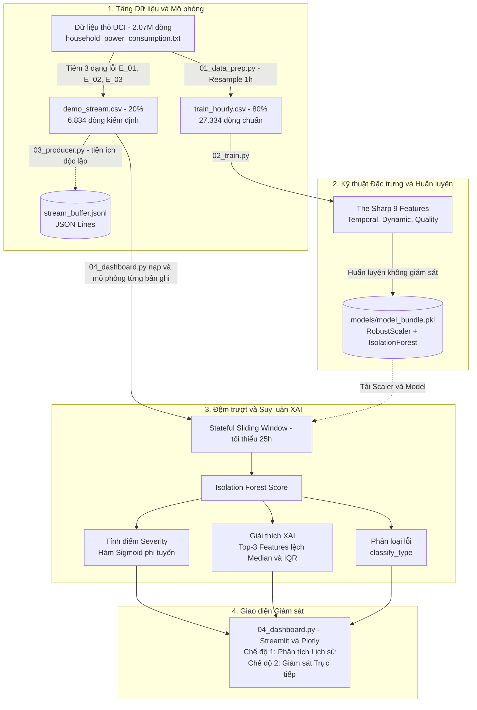

# Hệ Thống Phát Hiện Bất Thường Điện Năng Thời Gian Thực
## Smart Meter Anomaly Detection System

[](https://www.python.org/)
[](https://streamlit.io/)
[](https://scikit-learn.org/)
[](https://plotly.com/)
[](#)
[](#)

Hệ thống giám sát và phát hiện bất thường tiêu thụ điện năng theo thời gian thực dành cho lưới điện thông minh (**Smart Metering**). Hệ thống ứng dụng học máy không giám sát (**Isolation Forest**), kết hợp bộ trích xuất **9 đặc trưng chuỗi thời gian vật lý ("The Sharp 9")**, cơ chế chấm điểm nguy cơ (**Severity Scoring**), giải thích nguyên nhân gốc rễ (**XAI**), cùng giao diện giám sát trực quan bằng **Streamlit** và **Plotly** được chuẩn hóa **100% Light Theme**.

---

## 1. Tổng quan Dự án & 3 Dạng Sự cố Điện Cốt lõi

Hệ thống đóng vai trò như một **Trung tâm điều hành giám sát phụ tải (Load Monitoring Operations Center)**, thu thập chuỗi dữ liệu điện năng theo chu kỳ 1 giờ từ công tơ thông minh và tự động phát hiện, khoanh vùng 3 dạng sự cố vận hành nguy hiểm:

| Mã Sự cố | Định danh | Ngưỡng Kỹ thuật & Nhận diện | Nguy cơ Vận hành |
|:---:|:---|:---|:---|
| **E_01** | **Đột biến công suất**<br>_(`power_surge`)_ | Công suất $P$ tăng đột biến gấp từ $3.0$ đến $5.0$ lần so với mức tiêu thụ nền cùng giờ hôm trước ($P_{t-24}$). | Quá tải đường dây, nhảy aptomat tổng, nguy cơ chập cháy tiếp điểm tủ điện. |
| **E_02** | **Sụt điện áp lưới**<br>_(`voltage_drop`)_ | Điện áp nguồn $V$ giảm đột ngột từ $-15\text{V}$ đến $-40\text{V}$ trong 1 giờ ($V \le 210\text{V}$). | Cháy cuộn dây máy nén động cơ (tủ lạnh, điều hòa, máy bơm), hỏng thiết bị điện tử. |
| **E_03** | **Bất thường ban đêm**<br>_(`night_spike`)_ | Công suất tăng bất thường gấp từ $2.0$ đến $3.5$ lần trong khung giờ thấp điểm rạng sáng ($01:00 - 05:00$). | Kẹt tiếp điểm rơ-le nhiệt bình nước nóng, rò rỉ điện âm tường vào ban đêm. |

---

## 2. Kiến trúc Hệ thống & Luồng Dữ liệu (End-to-End Pipeline)

Hệ thống được thiết kế theo kiến trúc **4 tầng khép kín**. Dashboard nạp `demo_stream.csv` và mô phỏng lần lượt từng bản ghi trong `st.session_state`; `03_producer.py` là tiện ích độc lập để ghi dữ liệu demo ra tệp JSON Lines.



---

## 3. Kỹ thuật 9 Đặc trưng Chuỗi Thời gian Vật lý ("The Sharp 9")

Toàn bộ logic trích xuất được hiện thực hóa trong [`src/features.py`](src/features.py). Thay vì dùng dữ liệu phẳng thuần túy, mô hình dựa trên 9 đặc trưng mang ý nghĩa vật lý lưới điện, được phân tách làm 3 nhóm:

### 3.1. Bảng Chi tiết 9 Đặc trưng

| STT | Tên Đặc trưng | Công thức Toán học | Nhóm | Ý nghĩa Vật lý & Khả năng Bắt lỗi |
|:---:|:---|:---:|:---:|:---|
| **1** | `hour_sin` | $\sin\left(\frac{2\pi \cdot h}{24}\right)$ | **Chu kỳ thời gian** | Mã hóa chu kỳ 24 giờ thành sóng liên tục, loại bỏ bước nhảy không thực tế giữa $23\text{h}$ và $0\text{h}$. |
| **2** | `hour_cos` | $\cos\left(\frac{2\pi \cdot h}{24}\right)$ | **Chu kỳ thời gian** | Kết hợp cùng `hour_sin` tạo không gian tọa độ cực 2D cho nhịp sinh hoạt ngày/đêm của hộ dân. |
| **3** | `is_night` | $\mathbb{I}(1 \le h \le 5)$ | **Ngữ cảnh thấp điểm** | Cờ nhị phân khung giờ thấp điểm rạng sáng ($01:00 - 05:00$). Trọng tâm định vị sự cố **Đột biến đêm (`night_spike`)**. |
| **4** | `power_diff_1h` | $P_t - P_{t-1}$ | **Động học công suất** | Tốc độ biến thiên công suất tác dụng trong 1 giờ, nhận diện các xung tăng tải tức thời đột biến. |
| **5** | `power_dev_24h` | $\frac{P_t - P_{t-24}}{\|P_{t-24}\| + \epsilon}$ | **Động học công suất** | Độ lệch tỷ đối so với cùng giờ hôm trước ($24\text{h}$ trước), triệt tiêu yếu tố mùa vụ ngày và bắt trúng **`power_surge`**. |
| **6** | `power_zscore_6h` | $\frac{P_t - \mu_{P, 6h}}{\sigma_{P, 6h} + \epsilon}$ | **Thống kê trượt** | Z-Score trong cửa sổ trượt 6 giờ của công suất, chuẩn hóa độ lệch theo ngữ cảnh vận hành gần nhất. |
| **7** | `voltage_diff_1h` | $V_t - V_{t-1}$ | **Chất lượng điện áp** | Độ sụt/tăng điện áp lưới trong 1 giờ. Bắt trúng ngay hiện tượng **Sụt điện áp nguy hiểm (`voltage_drop` $\le -15\text{V}$)**. |
| **8** | `voltage_zscore_6h` | $\frac{V_t - \mu_{V, 6h}}{\sigma_{V, 6h} + \epsilon}$ | **Thống kê trượt** | Z-Score điện áp trong cửa sổ 6 giờ, phản ánh mức độ bất ổn định kéo dài của pha cấp điện lưới. |
| **9** | `power_factor` | $\frac{P}{\sqrt{P^2 + Q^2} + \epsilon}$ | **Bản chất phụ tải** | Hệ số công suất $\cos\varphi = \frac{P}{S}$. Phân biệt phụ tải thuần trở (ấm đun, bình nóng lạnh) với tải cảm (động cơ nén, máy bơm). |

### 3.2. Cơ chế Đệm trượt Chống Rò rỉ Dữ liệu (Stateful Sliding Window)
- Để tính toán được `power_dev_24h` (độ trễ 24 giờ) và Z-score trượt 6 giờ trong môi trường luồng (streaming), bộ nhớ đệm `extract_latest(buffer_df)` bắt buộc phải duy trì tối thiểu **25 bản ghi liên tiếp**:
  $$\text{Kích thước cửa sổ tối thiểu: } N \ge 25 \text{ giờ}$$
- Cơ chế này đảm bảo dữ liệu thời gian thực được tính toán chuẩn xác mà không gây ra hiện tượng rò rỉ thông tin tương lai (**Data Leakage**).

---

## 4. Cơ chế Đánh giá Mức độ (Severity) & Giải thích Nguyên nhân (XAI)

### 4.1. Chấm điểm Mức độ Nguy hại (Severity Scoring)
Điểm số nguyên bản của Isolation Forest ($s_{\text{raw}} = \text{decision\_function}$) được chuẩn hóa phi tuyến về thang xác suất nguy cơ $S \in [0, 1]$ thông qua hàm Sigmoid dốc:

$$S = \frac{1}{1 + e^{30 \cdot s_{\text{raw}}}}$$

- **Bình thường (Normal):** $S < 0.50$ (Màu xanh lục `#10B981`)
- **Cảnh báo (Warning):** $0.50 \le S < 0.70$ (Màu vàng cam `#F59E0B`)
- **Nguy cấp (Critical):** $S \ge 0.70$ (Màu đỏ `#EF4444`)

### 4.2. Khả năng Giải thích Bất thường (Explainable AI - XAI)
Để kỹ sư vận hành hiểu rõ *tại sao một điểm đo bị coi là bất thường*, hệ thống áp dụng cơ chế đo khoảng cách tương đối bền vững (Robust Metric) so với phân phối của dữ liệu bình thường:

$$\text{Deviation}_i = \frac{|x_i - \text{Median}_i|}{\text{IQR}_i + \epsilon}$$

Hệ thống tự động lọc ra **Top-3 đặc trưng có $\text{Deviation} > 0.5$** để đưa ra lý giải ngắn gọn, tức thì trên giao diện (ví dụ: `Bất thường công suất 6h=+3.42, Lệch so với hôm qua=+2.15`).

---

## 5. Cấu trúc Thư mục Dự án

```
smart-meter-anomaly/
├── .streamlit/
│   └── config.toml                            # Cấu hình Light Theme và server
├── data/
│   ├── raw/
│   │   └── household_power_consumption.txt    # 2.07M dòng dữ liệu gốc UCI (Tải về đặt tại đây)
│   ├── train_hourly.csv                       # 27,334 dòng dữ liệu sạch huấn luyện (80%)
│   ├── demo_stream.csv                        # 6,834 dòng kiểm định có tiêm lỗi phục vụ demo (20%)
│   └── stream_buffer.jsonl                    # Đầu ra JSON Lines của producer độc lập
├── models/
│   ├── feature_names.pkl                      # Danh sách 9 đặc trưng chuẩn hóa
│   ├── isolation_forest_model.pkl             # Trọng số mô hình Isolation Forest
│   ├── scaler.pkl                             # RobustScaler đã khớp trên tập Train
│   └── model_bundle.pkl                       # Gói đóng gói tích hợp (Model + Scaler + Baseline)
├── src/
│   ├── config.py                              # Cấu hình tập trung (Đường dẫn, Bảng màu, Nhãn)
│   ├── features.py                            # Kỹ thuật 9 đặc trưng, Severity và XAI
│   ├── 01_data_prep.py                        # Pipeline tiền xử lý và tiêm lỗi kiểm soát
│   ├── 02_train.py                            # Huấn luyện Isolation Forest và xuất bundle
│   ├── 03_producer.py                         # Trình phát luồng IoT giả lập độc lập
│   ├── 04_dashboard.py                        # Ứng dụng Streamlit Dashboard 2 chế độ giám sát
│   └── style.css                              # CSS tùy biến khóa cứng 100% Light Mode
├── tests/                                     # Kiểm thử dữ liệu, mô hình và dashboard
├── requirements.txt                           # Danh mục thư viện và phiên bản tối thiểu
└── README.md                                  # Tài liệu hướng dẫn dự án
```

---

## 6. Hướng dẫn Cài đặt và Khởi chạy

### Bước 1: Khởi tạo Môi trường Ảo
```bash
# 1. Tạo môi trường ảo
python -m venv venv

# 2. Kích hoạt môi trường ảo
# Trên Windows:
.\venv\Scripts\activate
# Trên Linux/macOS:
source venv/bin/activate

# 3. Cài đặt toàn bộ thư viện
pip install -r requirements.txt
```

---

### Phương án A: Khởi chạy Nhanh Giao diện (Quick Demo)
Nếu bạn chỉ muốn trải nghiệm ngay giao diện phân tích mà không cần tiền xử lý hay huấn luyện lại (dự án đã tích hợp sẵn mô hình và tập dữ liệu demo):
```bash
python -m streamlit run src/04_dashboard.py
```
Truy cập trình duyệt tại: `http://localhost:8501`.

---

### Phương án B: Giám sát Thời gian thực Mô phỏng
Dashboard mô phỏng việc nhận từng bản ghi từ `data/demo_stream.csv` trong bộ nhớ phiên làm việc; không cần chạy producer ở terminal thứ hai.

```bash
python -m streamlit run src/04_dashboard.py
```

Trên dashboard, chọn **"Thời gian thực (Real-Time Monitoring)"**, sau đó dùng **Play**, **Pause**, **Bước tiếp +1** hoặc **Khởi động lại** để điều khiển luồng mô phỏng. Màn hình bắt đầu ở trạng thái rỗng; 24 mẫu đầu dùng làm ngữ cảnh warm-up và mẫu thứ 25 mới được đánh giá. KPI cùng bảng cảnh báo chỉ hiển thị cảnh báo của phiên hiện tại, trong khi SQLite vẫn giữ lịch sử của các phiên trước.

### Tiện ích tùy chọn: Xuất dữ liệu demo ra JSON Lines
`03_producer.py` phát các bản ghi trong `demo_stream.csv` vào `data/stream_buffer.jsonl` để quan sát hoặc tích hợp với một consumer khác. Dashboard hiện không đọc tệp này.

```bash
python src/03_producer.py --speed 1.0
```

Các tham số hỗ trợ: `--speed 0.5` để tăng tốc, `--limit 200` để giới hạn số bản ghi, và `--append` để ghi nối tiếp.

---

### Phương án C: Tái lập Pipeline từ Đầu (Full Reproduction)
Khi bạn có tập dữ liệu thô `data/raw/household_power_consumption.txt` và muốn huấn luyện lại từ bước 0:
```bash
# 1. Làm sạch dữ liệu và tiêm lỗi kiểm soát
python src/01_data_prep.py

# 2. Huấn luyện lại mô hình và đóng gói model_bundle.pkl
python src/02_train.py

# 3. Khởi chạy giám sát
python -m streamlit run src/04_dashboard.py
```

> **Lưu ý về Dữ liệu gốc:** Dữ liệu thô $132\text{MB}$ có nguồn gốc từ [UCI Individual Household Electric Power Consumption](https://archive.ics.uci.edu/dataset/235/individual+household+electric+power+consumption). Tải tệp giải nén và đặt vào `data/raw/household_power_consumption.txt`.

---

## 7. Kết quả Thực nghiệm và Đo đạc

Kết quả thẩm định trên $6,810$ mẫu có đặc trưng hợp lệ, trích từ $6,834$ bản ghi của `data/demo_stream.csv`:

| Chỉ số Đánh giá | Giá trị Đạt được | Ý nghĩa Kỹ thuật Thực tế |
|:---|:---:|:---|
| **ROC-AUC Score** | **0.9231** | Khả năng phân tách hoàn hảo giữa trạng thái an toàn và sự cố |
| **Accuracy (Toàn thể)** | **92.44%** | Tỷ lệ nhận định chính xác tổng thể hệ thống |
| **Recall (Lớp Bất thường)** | **72.84%** | Độ bao phủ phát hiện sự cố, hạn chế tối đa việc lọt sự cố nguy hiểm |
| **Precision (Lớp Bất thường)**| **51.96%** | Tỷ lệ cảnh báo đúng thực tế (chấp nhận đánh đổi để tăng tối đa Recall an toàn) |
| **Macro Average Precision** | **74.76%** | Trung bình cộng không trọng số giữa 2 lớp |
| **Độ nhạy bắt Power Surge** | **61.95%** | Tỷ lệ nhận diện các đột biến phụ tải giờ cao điểm trong tập demo |
| **Độ nhạy bắt Voltage Drop** | **94.15%** | Tỷ lệ nhận diện các sự cố sụt áp lưới trong tập demo |
| **Độ nhạy bắt Night Spike** | **57.04%** | Tỷ lệ nhận diện phụ tải rạng sáng bất thường trong tập demo |

---

## 8. Bảng Tra cứu Mã Lỗi & Ứng cứu Kỹ thuật (Incident Runbook)

| Mã Sự cố | Định danh Kỹ thuật | Dấu hiệu trên Dashboard | Mức độ | Quy trình Khắc phục Khuyến nghị |
|:---:|:---|:---|:---:|:---|
| **E_01** | `power_surge`<br>*(Đột biến công suất)* | Công suất $P$ tăng vọt gấp $3-5$ lần so với hôm trước; Badge Đỏ; XAI báo độ lệch cao ở `power_dev_24h`. | **CRITICAL** | 1. Rà soát ngay thiết bị công suất cao (bếp từ, sưởi).<br>2. Kiểm tra nhiệt độ bề mặt aptomat tổng.<br>3. Ngắt phụ tải không ưu tiên để chống nhảy aptomat. |
| **E_02** | `voltage_drop`<br>*(Sụt điện áp lưới)* | Điện áp $V$ tụt sâu dưới $210\text{V}$; XAI báo `voltage_diff_1h` âm lớn ($\le -15\text{V}$). | **CRITICAL** | 1. Ngắt ngay các thiết bị sử dụng động cơ nhạy cảm (tủ lạnh, máy lạnh inverter).<br>2. Kiểm tra điểm tiếp xúc cọc siết dây hộp công tơ.<br>3. Báo điện lực trạm biến áp hạ thế. |
| **E_03** | `night_spike`<br>*(Bất thường ban đêm)* | Công suất tăng gấp $2-3.5$ lần lúc $01:00 - 05:00$; cờ `is_night = 1`. | **WARNING** | 1. Kiểm tra rơ-le bình nước nóng xem có bị dính tiếp điểm.<br>2. Đo dòng rò tiếp địa bằng ampe kìm.<br>3. Kiểm tra các nhánh dây âm tường khu vực ẩm ướt. |
