# BÁO CÁO ĐỒ ÁN NGÀNH

## HỆ THỐNG PHÁT HIỆN BẤT THƯỜNG ĐIỆN NĂNG TRÊN DỮ LIỆU CÔNG TƠ THÔNG MINH SỬ DỤNG ISOLATION FOREST

**Trường:** [Điền tên trường]<br>
**Khoa:** [Điền tên khoa]<br>
**Ngành:** [Điền tên ngành]<br>
**Sinh viên thực hiện:** [Điền họ tên]<br>
**Mã số sinh viên:** [Điền MSSV]<br>
**Giảng viên hướng dẫn:** [Điền họ tên giảng viên]<br>
**Địa điểm, năm:** [Điền thông tin]

---

# LỜI CẢM ƠN

[Bổ sung lời cảm ơn sau khi hoàn tất thông tin tác giả và giảng viên hướng dẫn.]

# NHẬN XÉT CỦA GIẢNG VIÊN HƯỚNG DẪN

[Dành cho giảng viên hướng dẫn.]

# TÓM TẮT

Đồ án xây dựng một hệ thống nguyên mẫu phát hiện bất thường trên dữ liệu công tơ điện thông minh theo giờ. Dữ liệu nguồn là bộ *Individual Household Electric Power Consumption* của UCI. Chuỗi sau làm sạch được chia theo thời gian thành 27.334 dòng huấn luyện và 6.834 dòng Demo. Hệ thống tính chín đặc trưng về chu kỳ thời gian, biến động công suất, biến động điện áp và hệ số công suất; 24 dòng đầu của mỗi chuỗi không đủ độ trễ 24 mẫu nên không được đưa vào mô hình. RobustScaler được khớp trên 27.310 mẫu huấn luyện hợp lệ, sau đó Isolation Forest gồm 200 cây được huấn luyện không giám sát với tối đa 512 mẫu trên mỗi cây và `contamination=0,08`.

Ba kịch bản tổng hợp được tiêm vào bản sao của phần Demo để tạo nhãn kiểm định: đột biến công suất ban ngày, sụt điện áp và đột biến công suất ban đêm. Sau bước tạo đặc trưng còn 6.810 mẫu, trong đó 545 mẫu mang nhãn tiêm tổng hợp. Với ngưỡng quyết định của model bundle hiện tại, hệ thống phát 764 cảnh báo, đạt ROC-AUC 0,923131 và Recall 72,84%. Dashboard Streamlit hỗ trợ hai chế độ: phân tích lịch sử và suy luận mô phỏng; cảnh báo có thể được lọc, tiếp nhận, ghi chú, đóng và xuất CSV. Mười test nghiệp vụ dùng chính dữ liệu UCI cùng hai test giao diện sáng đều đạt trong lần nghiệm thu. Các kết quả phản ánh khả năng nhận biết kịch bản tổng hợp trong dữ liệu của một hộ gia đình; chúng chưa chứng minh hiệu quả trên sự cố thiết bị đã được chuyên gia xác nhận.

**Từ khóa:** công tơ thông minh, phát hiện bất thường, Isolation Forest, RobustScaler, dữ liệu chuỗi thời gian, Streamlit.

# ABSTRACT

This project develops a prototype for detecting anomalies in hourly smart-meter data. The source is the UCI *Individual Household Electric Power Consumption* dataset. After cleaning, the time-ordered series is split into 27,334 training rows and 6,834 demo rows. Nine engineered features describe time cycles, power changes, voltage changes, and power factor. The first 24 rows of each sequence are unavailable because the feature pipeline requires a 24-sample lag. A RobustScaler is fitted on 27,310 valid training samples, followed by an unsupervised Isolation Forest with 200 trees, up to 512 samples per tree, and `contamination=0.08`.

Three synthetic scenarios are injected into a copy of the demo partition: daytime power surges, voltage drops, and nighttime power spikes. Feature extraction leaves 6,810 evaluation samples, including 545 injected labels. The current model bundle raises 764 alerts and obtains a ROC-AUC of 0.923131 and a Recall of 72.84%. A Streamlit dashboard provides historical analysis and simulated streaming, while an SQLite alert store supports filtering, acknowledgement, notes, closure, and CSV export. Ten UCI-based business tests and two light-theme tests pass in the acceptance run. These results measure detection against synthetic labels for one household and should not be interpreted as validation on expert-confirmed equipment faults.

**Keywords:** smart meter, anomaly detection, Isolation Forest, RobustScaler, time-series data, Streamlit.

# MỤC LỤC

- [Chương 1: Giới thiệu](#chuong-1)
- [Chương 2: Cơ sở lý thuyết và công trình liên quan](#chuong-2)
- [Chương 3: Phân tích và thiết kế hệ thống](#chuong-3)
- [Chương 4: Hiện thực và kiểm thử](#chuong-4)
- [Chương 5: Kết quả, đánh giá và kết luận](#chuong-5)
- [Tài liệu tham khảo](#tai-lieu-tham-khao)
- [Phụ lục](#phu-luc)

# DANH MỤC HÌNH

- Hình 1.1 — Ba kịch bản bất thường tổng hợp trong tập Demo.
- Hình 2.1 — Phân phối công suất theo khung giờ trên tập Train.
- Hình 2.2 — Phép chiếu đặc trưng Demo sau RobustScaler.
- Hình 2.3 — Quy trình học và chấm điểm của Isolation Forest.
- Hình 2.4 — Phân phối điểm quyết định trên tập Demo.
- Hình 3.1 — Kiến trúc mô-đun của hệ thống.
- Hình 3.2 — Ma trận tương quan Pearson của chín đặc trưng.
- Hình 3.3 — Luồng suy luận theo lô và theo tuần tự.
- Hình 3.4 — Vòng đời cảnh báo.
- Hình 3.5 — Wireframe hai chế độ của dashboard.
- Hình 4.1 — Phân chia thời gian và quy trình tạo tập thực nghiệm.
- Hình 5.1 — Đường cong ROC trên nhãn tiêm tổng hợp.
- Hình 5.2 — Ma trận nhầm lẫn chuẩn hóa theo nhãn thực nghiệm.
- Hình 5.3 — Recall theo từng kịch bản tổng hợp.

# DANH MỤC BẢNG

- Bảng 1.1 — Quy mô và vai trò của các tập dữ liệu.
- Bảng 1.2 — Mục tiêu đo được của đề tài.
- Bảng 2.1 — So sánh các công trình liên quan.
- Bảng 2.2 — Tham số RobustScaler trong model bundle hiện tại.
- Bảng 2.3 — Cấu hình Isolation Forest trong model bundle hiện tại.
- Bảng 3.1 — Yêu cầu chức năng.
- Bảng 3.2 — Yêu cầu phi chức năng.
- Bảng 3.3 — Cấu trúc chín đặc trưng.
- Bảng 3.4 — Cấu trúc bảng `alerts` trong SQLite.
- Bảng 4.1 — Môi trường nghiệm thu.
- Bảng 4.2 — Cấu hình tiêm ba kịch bản tổng hợp.
- Bảng 4.3 — Kết quả mười test nghiệp vụ.
- Bảng 5.1 — Chỉ số đánh giá tổng thể.
- Bảng 5.2 — Đối chiếu kết quả với mục tiêu.
- Bảng 5.3 — Hạn chế và hướng phát triển tương ứng.

# DANH MỤC TỪ VIẾT TẮT

| Từ viết tắt | Diễn giải |
|---|---|
| AUC | Area Under the Curve |
| CSV | Comma-Separated Values |
| FN | False Negative |
| FP | False Positive |
| IQR | Interquartile Range |
| ROC | Receiver Operating Characteristic |
| SQLite | Cơ sở dữ liệu quan hệ nhúng |
| TN | True Negative |
| TP | True Positive |
| UCI | University of California, Irvine Machine Learning Repository |
| UI | User Interface |

---

<a id="chuong-1"></a>

# CHƯƠNG 1: GIỚI THIỆU

## 1.1. Bối cảnh và vấn đề

Công tơ thông minh tạo ra chuỗi phép đo có mật độ cao hơn cách ghi chỉ số thủ công. Chuỗi này cho phép quan sát biến động tải theo giờ, nhưng số lượng điểm đo khiến người vận hành khó kiểm tra từng thời điểm bằng mắt. Một giá trị khác thường có thể liên quan đến thay đổi hành vi sử dụng, sự cố điện áp, sai số cảm biến hoặc dữ liệu bị thiếu. Phát hiện bất thường vì vậy là bước sàng lọc: hệ thống ưu tiên những thời điểm cần xem xét và cung cấp dấu hiệu hỗ trợ phân tích, còn quyết định nguyên nhân cuối cùng vẫn cần ngữ cảnh vận hành.

Đề tài sử dụng bộ *Individual Household Electric Power Consumption* của UCI, gồm phép đo theo phút của một hộ gia đình tại Pháp từ tháng 12/2006 đến tháng 11/2010 [1]. Đây là dữ liệu tiêu thụ thực nhưng không kèm nhãn sự cố thiết bị đã được xác nhận. Bài toán được đặt theo hướng phát hiện bất thường không giám sát, phù hợp với tình huống dữ liệu nền nhiều nhưng nhãn hiếm hoặc không đầy đủ [2]. Để có cơ sở kiểm định lặp lại, ba kịch bản được tiêm vào bản sao của tập Demo. Hình 1.1 trình bày một cửa sổ dữ liệu thực cho mỗi kịch bản; đường liên tục là chuỗi Demo sau khi tiêm, còn ký hiệu màu chỉ đúng điểm được thay đổi.

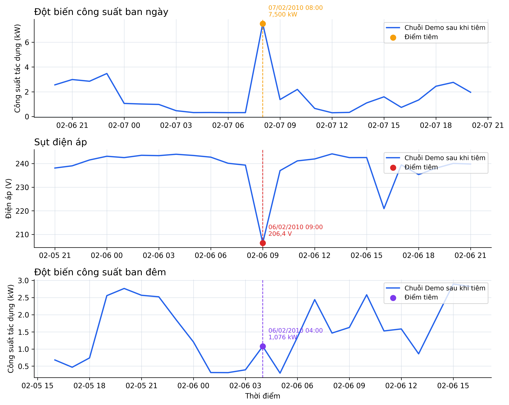

*Hình 1.1 — Ba kịch bản bất thường tổng hợp trong tập Demo: đột biến công suất ban ngày, sụt điện áp và đột biến công suất ban đêm. Nguồn: dữ liệu và script tạo hình của đề tài.*

Nhãn trong Hình 1.1 là nhãn tiêm tổng hợp, không phải kết luận về sự cố điện thực tế. Cách gọi này được duy trì xuyên suốt báo cáo để phân biệt rõ dữ liệu kiểm định với chẩn đoán chuyên gia.

## 1.2. Mục tiêu

Hệ thống hướng đến người vận hành nguyên mẫu cần xem nhanh diễn biến đo, phát hiện điểm đáng chú ý và quản lý vòng đời cảnh báo. Bảng 1.1 xác định quy mô và vai trò của từng tập trước khi Bảng 1.2 lượng hóa năm mục tiêu; mã mục tiêu được dùng lại ở Chương 5 để đánh giá mức hoàn thành.

*Bảng 1.1 — Quy mô và vai trò của các tập dữ liệu*

| Tập | Khoảng thời gian | Số dòng gốc | Số mẫu đủ đặc trưng | Vai trò |
|---|---:|---:|---:|---|
| Train | 16/12/2006 17:00 – 05/02/2010 04:00 | 27.334 | 27.310 | Khớp RobustScaler, học Isolation Forest và thống kê nền |
| Demo | 05/02/2010 05:00 – 26/11/2010 21:00 | 6.834 | 6.810 | Tiêm kịch bản, đánh giá và mô phỏng luồng |

*Nguồn: kiểm tra trực tiếp `train_hourly.csv` và `demo_stream.csv`.*

*Bảng 1.2 — Mục tiêu đo được của đề tài*

| Mã | Mục tiêu | Tiêu chí nghiệm thu |
|---|---|---|
| MT01 | Xây dựng pipeline dữ liệu có thể chạy lại | Tách Train/Demo theo thời gian; không tiêm nhãn vào Train; dữ liệu và bundle không đổi sau kiểm thử |
| MT02 | Dùng thống nhất chín đặc trưng trong huấn luyện và suy luận | Đúng thứ tự chín đặc trưng; warm-up và công thức được kiểm thử |
| MT03 | Phát hiện kịch bản tổng hợp có chất lượng định lượng | ROC-AUC > 0,90 và Recall tổng thể > 70% trên Demo hợp lệ |
| MT04 | Hỗ trợ người vận hành xử lý cảnh báo | Có lọc, xem chi tiết, tiếp nhận, ghi chú, đóng và xuất CSV |
| MT05 | Có kiểm thử tự động cho các luồng chính | Mười test nghiệp vụ dùng UCI và các test giao diện sáng đều đạt |

## 1.3. Đối tượng và phạm vi

Đối tượng xử lý là chuỗi công suất, điện áp và công suất phản kháng đã gom theo giờ. Đối tượng sử dụng là người vận hành nguyên mẫu, không phải người tiêu dùng cuối hay hệ thống điều khiển lưới điện. Đề tài tập trung vào một hộ gia đình, một mô hình Isolation Forest, một pipeline đặc trưng và một dashboard chạy cục bộ. Phần Demo mô phỏng tuần tự theo từng bản ghi; nó không kết nối công tơ, message broker hoặc hạ tầng thời gian thực bên ngoài.

Phạm vi không bao gồm dự báo phụ tải, định vị thiết bị gây lỗi, điều khiển đóng cắt, xác nhận nguyên nhân vật lý, đánh giá nhiều hộ gia đình, bảo mật triển khai sản xuất và so sánh thực nghiệm với mạng nơ-ron sâu. Ba loại sau hậu xử lý chỉ là nhãn diễn giải cho cảnh báo. Chúng không phải ba lớp được Isolation Forest học và cũng không được tiêm vào tập Train.

## 1.4. Phương pháp thực hiện

Quy trình gồm năm bước. Dữ liệu phút được làm sạch, lấy trung bình theo giờ và chia theo thứ tự thời gian 80/20. Từ các cột đo gốc, hệ thống tính chín đặc trưng dùng chung. RobustScaler và Isolation Forest chỉ được khớp trên Train. Bản sao Demo được tiêm kịch bản với seed cố định, sau đó được biến đổi bằng scaler đã học và chấm điểm bằng model đã lưu. Cuối cùng, kết quả được đánh giá định lượng và trình bày trên dashboard cùng kho cảnh báo SQLite.

## 1.5. Bố cục báo cáo

Chương 2 trình bày lý thuyết, công trình liên quan và ý nghĩa chính xác của các điểm số. Chương 3 chuyển các yêu cầu thành kiến trúc, thiết kế dữ liệu, đặc trưng, luồng suy luận và giao diện. Chương 4 mô tả hiện thực, môi trường, quy trình thực nghiệm và test case. Chương 5 phân tích kết quả, ba trường hợp cụ thể, mức hoàn thành mục tiêu, hạn chế và hướng phát triển.

---

<a id="chuong-2"></a>

# CHƯƠNG 2: CƠ SỞ LÝ THUYẾT VÀ CÔNG TRÌNH LIÊN QUAN

## 2.1. Phát hiện bất thường không giám sát

Một điểm bất thường là quan sát khác đáng kể so với phần lớn dữ liệu theo một tiêu chí đã xác định [2]. Trong chuỗi điện năng, khác biệt có thể xuất hiện ở trị đo tức thời, mức thay đổi so với mẫu trước, quan hệ với cùng thời điểm trước đó hoặc hành vi trong một cửa sổ cục bộ. Vì vậy, chỉ đặt một ngưỡng trên công suất không đủ để biểu diễn toàn bộ bối cảnh.

Đề tài chọn học không giám sát vì dữ liệu UCI không có nhãn sự cố chuyên gia. Isolation Forest phù hợp với mục tiêu sàng lọc vì mô hình cô lập trực tiếp quan sát hiếm, không cần ước lượng mật độ của lớp bình thường và có thể chấm điểm cho mỗi mẫu [3], [4]. Nhãn tổng hợp chỉ tham gia đánh giá sau huấn luyện. Thiết kế này ngăn mô hình học trực tiếp quy tắc tiêm, đồng thời cho phép đo khả năng phát hiện trên các thay đổi đã biết.

Phân phối công suất của Train trong Hình 2.1 cho thấy ngữ cảnh 01:00–05:00 khác các giờ còn lại. Trục tung là mật độ xác suất: mỗi histogram được chuẩn hóa để tổng diện tích bằng 1, do đó chiều cao không phải số lượng mẫu. Biểu đồ dùng đủ 27.334 dòng Train và hiển thị miền giá trị đầy đủ; ô phóng to chỉ hỗ trợ đọc vùng tập trung.

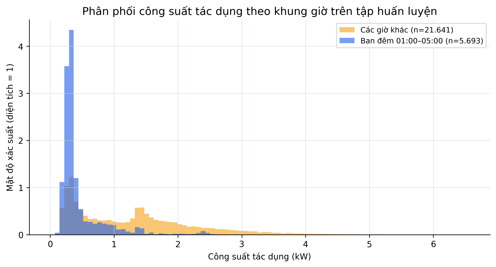

*Hình 2.1 — Phân phối `Global_active_power` trên Train, tách giờ đêm 01:00–05:00 và các giờ còn lại. Nguồn: tính trực tiếp từ `train_hourly.csv`.*

## 2.2. Công trình liên quan

Isolation Forest gốc của Liu, Ting và Zhou xây dựng nhiều cây phân hoạch ngẫu nhiên; điểm cần ít phép chia hơn để bị cô lập được xem là bất thường [3]. Công trình tiếp theo hệ thống hóa cách chuẩn hóa chiều dài đường đi và mở rộng đánh giá của họ thuật toán này [4]. Ưu điểm phù hợp với đề tài là không cần nhãn để huấn luyện và có chi phí dự đoán thuận lợi với dữ liệu dạng bảng. Hạn chế là mô hình không tự biểu diễn thứ tự thời gian, nên thông tin chu kỳ và độ trễ phải được đưa vào bằng đặc trưng.

Wang, Gu và Liu kết hợp phân cụm, phân tích thành phần chính, trọng số entropy và Isolation Forest trên dữ liệu điện của 6.445 người dùng [5]. Cách tiếp cận đưa mức quan trọng của thuộc tính vào phép phát hiện và xử lý dữ liệu nhiều người dùng. Tuy nhiên, pipeline phức tạp hơn và mục tiêu dữ liệu khác với chuỗi một hộ gia đình theo giờ trong đề tài này.

Dai và cộng sự đề xuất variational recurrent autoencoder có attention cho phát hiện bất thường dữ liệu công tơ [6]. Mạng hồi tiếp có khả năng học quan hệ thời gian thay vì dựa chủ yếu vào đặc trưng thủ công. Đổi lại, phương pháp cần nhiều tài nguyên huấn luyện, nhiều lựa chọn siêu tham số và cơ chế giải thích riêng. Nghiên cứu được kiểm tra trên một ca dữ liệu nhiệt độ cấp nước nóng công nghiệp; metric của nghiên cứu đó không được so trực tiếp với kết quả UCI của đề tài.

Bảng 2.1 so sánh theo dữ liệu, cách biểu diễn và phạm vi đánh giá. Mục đích của bảng là xác định lựa chọn kỹ thuật, không xếp hạng các công trình bằng metric từ những tập dữ liệu khác nhau.

*Bảng 2.1 — So sánh các công trình liên quan*

| Công trình | Dữ liệu và biểu diễn | Phương pháp | Điểm phù hợp | Giới hạn khi áp dụng cho đề tài |
|---|---|---|---|---|
| Liu và cộng sự [3], [4] | Dữ liệu dạng bảng, không bắt buộc nhãn | Cây cô lập ngẫu nhiên | Pipeline gọn, có điểm bất thường | Không tự học trật tự thời gian |
| Wang và cộng sự [5] | 6.445 người dùng điện, nhiều thuộc tính | Entropy weight, PCA và Isolation Forest | Kết hợp trọng số thuộc tính | Nhiều bước, phạm vi nhiều người dùng khác dữ liệu đề tài |
| Dai và cộng sự [6] | Chuỗi công tơ trong ca công nghiệp | VRAE có attention | Học quan hệ thời gian | Tài nguyên và độ phức tạp cao; dữ liệu đánh giá khác |
| Hệ thống đề tài | Một hộ gia đình; chín đặc trưng theo giờ | RobustScaler và Isolation Forest | Dễ tái lập, tích hợp dashboard và vòng đời cảnh báo | Nhãn tổng hợp; chưa so sánh mô hình trên cùng protocol |

Khoảng trống mà đề tài tập trung là một quy trình đầu cuối có thể kiểm tra: từ dữ liệu UCI, đặc trưng dùng chung, model bundle, suy luận theo lô/tuần tự đến thao tác cảnh báo. Đề tài không tuyên bố cải thiện thuật toán Isolation Forest; đóng góp nằm ở tính nhất quán và minh chứng hiện thực.

## 2.3. RobustScaler

Chín đặc trưng có miền đo khác nhau. `power_factor` nằm trong khoảng 0–1, trong khi biến động điện áp có thể đạt hàng chục volt. RobustScaler của Scikit-learn dùng trung vị và khoảng tứ phân vị nên ít bị chi phối bởi giá trị cực đoan hơn phép chuẩn hóa dùng trung bình và độ lệch chuẩn [7]. Với đặc trưng \(x_j\), các đại lượng được xác định bởi:

\[
Q_{1,j}=P_{25}(x_j),\qquad Q_{3,j}=P_{75}(x_j),\qquad IQR_j=Q_{3,j}-Q_{1,j}. \tag{2.1}
\]

Phép biến đổi của cấu hình mặc định là:

\[
\tilde{x}_{ij}=\frac{x_{ij}-\operatorname{median}(x_j)}{\operatorname{scale}_j}. \tag{2.2}
\]

Trong đa số cột, `scale_` bằng IQR. Khi IQR bằng 0, Scikit-learn thay hệ số chia bằng 1 để tránh chia cho 0. Vì vậy, cột `is_night` có Q1 = Q3 = IQR = 0 nhưng `scale_ = 1`. Tên “hệ số chia `scale_`” chính xác hơn cách gọi mọi giá trị trong cột này là IQR.

`fit` ước lượng `center_` và `scale_`; `transform` áp dụng các tham số đã học; `fit_transform` thực hiện hai thao tác liên tiếp trên cùng tập. Trong pipeline, `fit_transform` chỉ chạy trên 27.310 mẫu Train. Demo chỉ gọi `transform`, nhờ đó không đưa phân phối kiểm định vào bước học. Ví dụ, với `power_diff_1h = 0,487575` kW, `center_ = -0,007217` và `scale_ = 0,494792`, kết quả là \((0,487575+0,007217)/0,494792=1,000\). Điểm này nằm cao hơn trung vị Train đúng một hệ số chia.

Bảng 2.2 ghi các tham số đọc trực tiếp từ `model_bundle.pkl`. Những giá trị này có thể thay đổi khi dữ liệu hoặc quy trình huấn luyện thay đổi.

*Bảng 2.2 — Tham số RobustScaler trong model bundle hiện tại*

| Đặc trưng | `center_` | Hệ số chia `scale_` | IQR tính trực tiếp trên Train |
|---|---:|---:|---:|
| `hour_sin` | 0,000000 | 1,414214 | 1,414214 |
| `hour_cos` | 0,000000 | 1,414214 | 1,414214 |
| `is_night` | 0,000000 | 1,000000 | 0,000000 |
| `power_diff_1h` | -0,007217 | 0,494792 | 0,494792 |
| `power_dev_24h` | -0,002293 | 0,908084 | 0,908084 |
| `power_zscore_6h` | -0,320253 | 1,698758 | 1,698758 |
| `voltage_diff_1h` | -0,002667 | 2,091827 | 2,091827 |
| `voltage_zscore_6h` | 0,025787 | 1,840346 | 1,840346 |
| `power_factor` | 0,989848 | 0,037069 | 0,037069 |

Isolation Forest không phụ thuộc khoảng cách Euclid nên không bắt buộc chuẩn hóa theo cách của k-nearest neighbors hoặc SVM. Đề tài vẫn dùng RobustScaler để cố định một biểu diễn đầu vào, thuận lợi khi so sánh hoặc thay mô hình trong tương lai. Chưa có thí nghiệm ablation đối chứng có/không có scaler, vì vậy báo cáo không kết luận scaler làm tăng metric hiện tại.

Hình 2.2 chiếu hai trong chín chiều sau khi áp dụng scaler của Train lên Demo. Mỗi ô dùng cặp đặc trưng và ngữ cảnh giờ phù hợp với một kịch bản. Trục biểu diễn số hệ số chia lệch khỏi trung vị Train; các điểm màu là nhãn tiêm tổng hợp. Đây là phép chiếu để quan sát, không phải ranh giới quyết định đầy đủ của Isolation Forest trong không gian chín chiều.

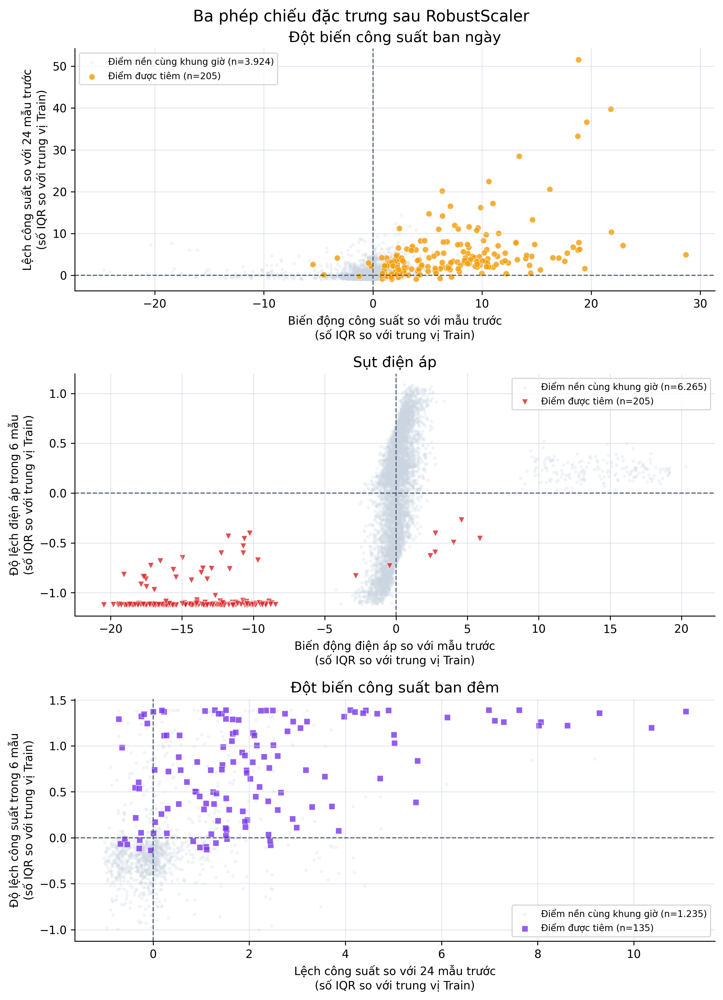

*Hình 2.2 — Phép chiếu các đặc trưng Demo sau `scaler.transform()`: 205 `power_surge`, 205 `voltage_drop` và 135 `night_spike`. Nguồn: `demo_stream.csv` và scaler trong model bundle.*

## 2.4. Isolation Forest

Isolation Forest tạo nhiều cây nhị phân. Với mỗi cây, thuật toán lấy ngẫu nhiên tối đa ψ mẫu, chọn một đặc trưng và một ngưỡng chia ngẫu nhiên trong miền quan sát của đặc trưng đó. Điểm hiếm thường bị tách khỏi phần còn lại sau ít nút hơn. Đề tài dùng 200 cây, mỗi cây tối đa 512 mẫu và cả chín đặc trưng. Giá trị dự đoán là kết quả tổng hợp từ toàn bộ rừng, không phải bình chọn loại sự cố.

Chiều dài đường đi kỳ vọng của một cây tìm kiếm nhị phân không thành công được dùng để hiệu chỉnh theo kích thước mẫu:

\[
c(n)=2H_{n-1}-\frac{2(n-1)}{n},\qquad H_k\approx \ln(k)+\gamma. \tag{2.3}
\]

Trong đó \(n\) là số mẫu dùng xây cây, \(H_k\) là số điều hòa thứ \(k\), và γ là hằng số Euler. Dạng điểm trong công trình gốc là:

\[
s(x,n)=2^{-\frac{E[h(x)]}{c(n)}}. \tag{2.4}
\]

\(h(x)\) là chiều dài đường đi của \(x\), còn \(E[h(x)]\) là trung bình trên các cây. Điểm gần 1 biểu thị dễ cô lập hơn theo định nghĩa gốc. Khi dùng Scikit-learn, cần phân biệt bốn API. `score_samples(X)` trả điểm “độ bình thường” theo quy ước của thư viện: giá trị thấp hơn bất thường hơn. Thuộc tính `offset_` xác định độ dịch của ngưỡng. `decision_function(X)` được tính theo:

\[
d(x)=\operatorname{score\_samples}(x)-\operatorname{offset\_}. \tag{2.5}
\]

`predict(X)` trả -1 khi \(d(x)<0\) và 1 khi \(d(x)\ge 0\). Bundle hiện tại có `offset_=-0,527125`; giá trị này được học theo cấu hình `contamination=0,08`, không phải ngưỡng mặc định và không phải tỷ lệ lỗi tiêm vào Train. Cấu hình contamination đặt ranh giới sao cho một tỷ lệ tương ứng của dữ liệu huấn luyện nằm phía bất thường theo cơ chế của thư viện [8]. Hình 2.3 tách luồng học trên Train khỏi luồng chấm điểm; `n_jobs=-1` chỉ giúp song song hóa quá trình `fit` của tập cây trong hiện thực hiện tại, không thay đổi công thức dự đoán.

Giá trị 0,08 được chọn như một **giả định của thiết kế thực nghiệm**. Ba kịch bản trên Demo được đặt ở các tỷ lệ danh nghĩa 3% đột biến công suất ban ngày, 3% sụt điện áp và 2% đột biến công suất ban đêm; tổng danh nghĩa bằng 8%. Mức tiêm này giữ bất thường là lớp thiểu số nhưng vẫn tạo hơn 100 mẫu cho mỗi kịch bản để có thể tính Recall riêng. `contamination=0,08` sau đó được dùng làm điểm vận hành ban đầu, sao cho tỷ lệ điểm mô hình kỳ vọng xếp vào vùng bất thường trên Train gần với tổng tỷ lệ tiêm danh nghĩa của Demo. Do phép lấy phần nguyên, trước warm-up có 546/6.834 = 7,99% điểm được tiêm; sau warm-up còn 545/6.810 = 8,00%.

Lựa chọn trên không có nghĩa UCI chứa 8% sự cố thực tế. Tập Train không được tiêm lỗi và không có nhãn sự cố; `contamination` chỉ dùng giả định tỷ lệ để xác định `offset_`. Cấu hình không sử dụng nhãn của từng điểm Demo, nhưng đã sử dụng thông tin thiết kế về tỷ lệ tổng thể của bộ kiểm định. Vì đề tài chưa thực hiện tìm kiếm tham số hoặc phân tích độ nhạy trên nhiều mức contamination, 0,08 chưa được chứng minh là tối ưu. Khi triển khai thực tế, ngưỡng cần được chọn trên tập validation tách theo thời gian hoặc theo chi phí giữa bỏ sót và cảnh báo ngoài nhãn, thay vì mặc định giữ tỷ lệ 8%.

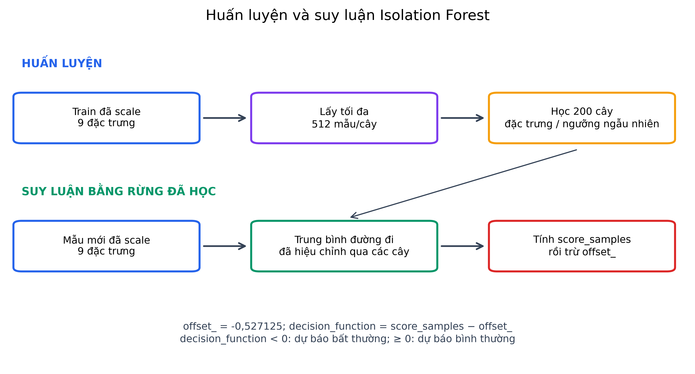

*Hình 2.3 — Quy trình khớp RobustScaler, xây 200 cây và tính `decision_function`. Các tham số được đọc từ model bundle hiện tại. Nguồn: hiện thực của đề tài và quy ước API Scikit-learn [8].*

Ảnh hưởng của từng tham số được diễn giải như sau. Tăng `n_estimators` thường làm kết quả tổng hợp ổn định hơn nhưng tăng thời gian và bộ nhớ. `max_samples=512` giới hạn kích thước mẫu của mỗi cây; giá trị lớn hơn cho cây nhìn thấy nhiều dữ liệu hơn nhưng làm tăng chiều sâu và chi phí. `max_features=1,0` cho phép mỗi cây dùng toàn bộ chín đặc trưng khi chọn phép chia. `contamination=0,08` xác định offset dùng cho dự đoán nhị phân. `random_state=42` cố định các phép lấy mẫu và chia ngẫu nhiên để tái lập bundle. Không tham số nào gán trực tiếp ba loại sự cố.

*Bảng 2.3 — Cấu hình Isolation Forest trong model bundle hiện tại*

| Tham số | Giá trị | Vai trò trong hiện thực |
|---|---:|---|
| `n_estimators` | 200 | Số cây cô lập |
| `max_samples` | 512 | Số mẫu tối đa dùng cho mỗi cây |
| `max_features` | 1,0 | Tỷ lệ đặc trưng khả dụng trên mỗi cây |
| `contamination` | 0,08 | Cấu hình xác định offset dự đoán trên Train |
| `random_state` | 42 | Tái lập lấy mẫu và phép chia |
| `n_jobs` | -1 | Dùng các lõi CPU khả dụng khi huấn luyện |
| Số chiều đầu vào | 9 | Thứ tự lưu trong trường `features` của bundle |
| `offset_` | -0,527125 | Ngưỡng dịch hiện có sau huấn luyện |

Hình 2.4 cho biết mức phân tách của điểm quyết định trên 6.810 mẫu Demo. Biểu đồ nhóm theo nhãn kiểm định: 6.265 điểm không được tiêm và 545 điểm được tiêm. Đường \(d(x)=0\) là ranh giới dự đoán; vùng âm tạo cảnh báo. Việc tô màu theo nhãn thay vì theo dự đoán cho phép quan sát cả phần chồng lấn gây bỏ sót và cảnh báo ngoài nhãn tiêm.

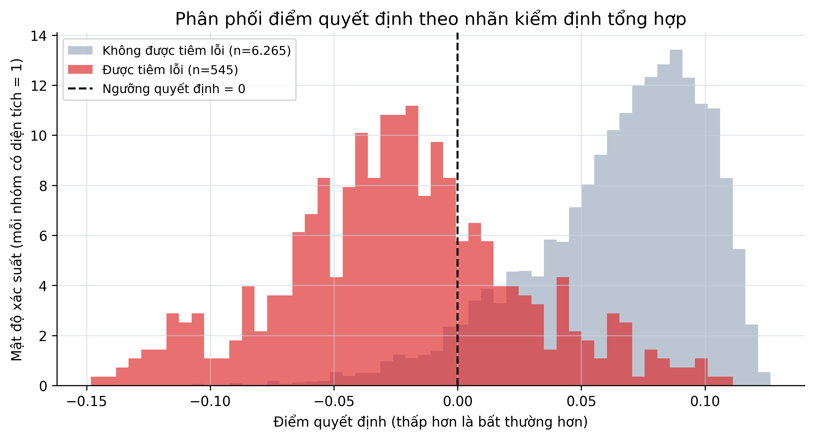

*Hình 2.4 — Phân phối `decision_function` của 6.810 mẫu Demo theo nhãn tiêm tổng hợp. Nguồn: model bundle và `demo_stream.csv`.*

## 2.5. Ba tầng kết quả và chỉ số đánh giá

Hệ thống có ba tầng kết quả độc lập về vai trò. Tầng thứ nhất, Isolation Forest quyết định bình thường hoặc bất thường bằng dấu của \(d(x)\). Tầng thứ hai, hàm sigmoid đổi điểm quyết định thành severity để sắp xếp và hiển thị:

\[
\operatorname{severity}(d)=\frac{1}{1+e^{30d}}. \tag{2.6}
\]

Severity nằm trong [0,1], giảm khi \(d\) tăng và bằng 0,5 tại ngưỡng. Đây không phải xác suất lỗi vì hàm chưa được hiệu chuẩn xác suất. Hệ thống gán `warning` khi severity từ 0,50 đến dưới 0,70 và `critical` khi từ 0,70 trở lên. Tầng thứ ba, `classify_type()` áp dụng quy tắc ưu tiên sụt áp, đột biến đêm, rồi đột biến công suất; `explain_anomaly()` xếp hạng độ lệch tuyệt đối so với median/IQR của Train. Hai hàm này chạy sau dự đoán, không tham gia huấn luyện và không thay đổi \(d(x)\).

Với nhãn dương là điểm được tiêm, các chỉ số được dùng gồm:

\[
\operatorname{Precision}=\frac{TP}{TP+FP},\qquad
\operatorname{Recall}=\frac{TP}{TP+FN}. \tag{2.7}
\]

\[
F_1=2\frac{\operatorname{Precision}\cdot\operatorname{Recall}}
{\operatorname{Precision}+\operatorname{Recall}},\qquad
\operatorname{Accuracy}=\frac{TP+TN}{TP+TN+FP+FN}. \tag{2.8}
\]

ROC-AUC đánh giá thứ hạng liên tục của \(-d(x)\) trên nhiều ngưỡng. Accuracy cần được đọc cùng Recall, Precision và ma trận nhầm lẫn vì lớp bất thường chỉ chiếm 545/6.810 mẫu. FP trong thực nghiệm nghĩa là “cảnh báo ngoài nhãn tiêm”, chưa đủ cơ sở gọi là cảnh báo sai trong vận hành thực tế.

---

<a id="chuong-3"></a>

# CHƯƠNG 3: PHÂN TÍCH VÀ THIẾT KẾ HỆ THỐNG

## 3.1. Tác nhân và yêu cầu

Tác nhân chính là người vận hành nguyên mẫu. Người này cần xem dữ liệu lịch sử, quan sát luồng mô phỏng và quản lý cảnh báo. Tác nhân kỹ thuật phụ là người huấn luyện mô hình, chịu trách nhiệm chuẩn bị dữ liệu và tạo model bundle trước khi dashboard chạy. Các yêu cầu chức năng trong Bảng 3.1 được rút ra từ ba luồng sử dụng chính và các chức năng hiện có trong mã nguồn.

*Bảng 3.1 — Yêu cầu chức năng*

| Yêu cầu | Tiêu chí chấp nhận |
|---|---|
| Chuẩn bị dữ liệu theo giờ | Đọc UCI, xử lý thiếu, gom theo giờ và chia 80/20 theo thời gian |
| Tạo đặc trưng dùng chung | Huấn luyện và suy luận gọi cùng `extract_features()`/`extract_latest()` |
| Huấn luyện và lưu mô hình | Bundle chứa model, scaler, thứ tự đặc trưng, median và IQR |
| Phân tích lịch sử | Lọc khoảng ngày, hiển thị KPI, biểu đồ và bảng điểm bất thường |
| Suy luận mô phỏng | Play, Pause, bước tiếp, tốc độ, reset và trạng thái warm-up |
| Diễn giải cảnh báo | Hiển thị severity, dạng gợi ý và tối đa ba dấu hiệu nổi bật |
| Quản lý vòng đời | Lưu duy nhất theo `alert_id`, tiếp nhận, ghi chú và đóng |
| Xuất kết quả | Tải danh sách cảnh báo đang lọc dưới dạng CSV |

Ngoài chức năng, hệ thống cần bảo đảm tái lập, an toàn dữ liệu và khả năng đọc giao diện. Bảng 3.2 nêu các yêu cầu phi chức năng gắn với cách triển khai hiện tại.

*Bảng 3.2 — Yêu cầu phi chức năng*

| Yêu cầu | Cách kiểm chứng |
|---|---|
| Tái lập | Cố định seed 42 khi tiêm bất thường và huấn luyện Isolation Forest |
| Không rò rỉ dữ liệu | Scaler/model chỉ `fit` trên Train; Demo chỉ `transform` và đánh giá |
| Bảo vệ dữ liệu | Trích xuất đặc trưng trên bản sao; suy luận không ghi đè CSV đầu vào |
| Nhất quán giao diện sáng | Cấu hình theme và CSS ép bảng/widget về màu sáng độc lập browser theme |
| Truy vết | ID cảnh báo theo thời điểm dữ liệu; bundle lưu đúng thứ tự đặc trưng |
| Khả năng chạy cục bộ | Chạy dashboard với CSV Demo và model bundle trên máy cục bộ |

## 3.2. Đặc tả ba Use Case chính

### 3.2.1. UC01 — Phân tích lịch sử

**Tác nhân:** người vận hành. **Tiền điều kiện:** có Demo và model bundle. **Luồng chính:** người dùng chọn chế độ lịch sử, chọn khoảng ngày; hệ thống trích xuất đặc trưng cho phần dữ liệu, dùng scaler/model đã học để tính điểm, tổng hợp KPI và vẽ hai chuỗi công suất/điện áp; bảng bên dưới chỉ liệt kê điểm có \(d(x)<0\). Bảng hiển thị dữ liệu đo, severity, dạng gợi ý và dấu hiệu; chế độ này không có thao tác chọn dòng xem chi tiết. **Ngoại lệ:** nếu khoảng ngày rỗng hoặc không đủ đặc trưng, giao diện hiển thị thông báo thay vì kết luận bình thường. **Hậu điều kiện:** thao tác xem lịch sử không ghi cảnh báo mới vào SQLite.

### 3.2.2. UC02 — Suy luận mô phỏng tuần tự

**Tác nhân:** người vận hành. **Tiền điều kiện:** có Demo, bundle và kho SQLite khả dụng. **Luồng chính:** hệ thống đọc lần lượt từng hàng theo con trỏ, giữ tối đa 50 hàng trong buffer, tính đặc trưng cho mẫu mới nhất khi buffer có ít nhất 25 hàng, rồi hiển thị điểm và lưu cảnh báo mới. Người dùng có thể chạy, tạm dừng, bước một mẫu, đổi tốc độ hoặc khởi động lại luồng. **Luồng warm-up:** 24 mẫu đầu có `evaluation_status="warming_up"`, `is_anomaly=None` và chưa được tính vào tỷ lệ bình thường. **Hậu điều kiện:** cảnh báo có ID `ALT-YYYYMMDDHHMMSS`; thao tác lặp trên cùng thời điểm không tạo bản ghi trùng.

### 3.2.3. UC03 — Xử lý và xuất cảnh báo

**Tác nhân:** người vận hành. **Tiền điều kiện:** SQLite có ít nhất một cảnh báo. **Luồng chính:** người dùng lọc theo trạng thái và dạng gợi ý, chọn ID, xem chi tiết, nhập ghi chú, bấm “Tiếp nhận cảnh báo” hoặc “Đóng cảnh báo”. Hệ thống cập nhật trạng thái và thời điểm tương ứng. Người dùng có thể tải phần đang lọc thành `bao_cao_canh_bao.csv`. **Ngoại lệ:** khi không có bản ghi phù hợp, giao diện thông báo hàng đợi trống. **Hậu điều kiện:** thay đổi được duy trì qua lần rerun Streamlit.

## 3.3. Kiến trúc mô-đun

Hình 3.1 mô tả các thành phần và dữ liệu trao đổi. `01_data_prep.py` chuyển dữ liệu thô thành Train và Demo. `features.py` là nguồn duy nhất của công thức đặc trưng và hậu xử lý. `02_train.py` khớp scaler/model rồi đóng gói thành bundle. `04_dashboard.py` đọc Demo và bundle để phục vụ hai chế độ, đồng thời giao tiếp với SQLite.

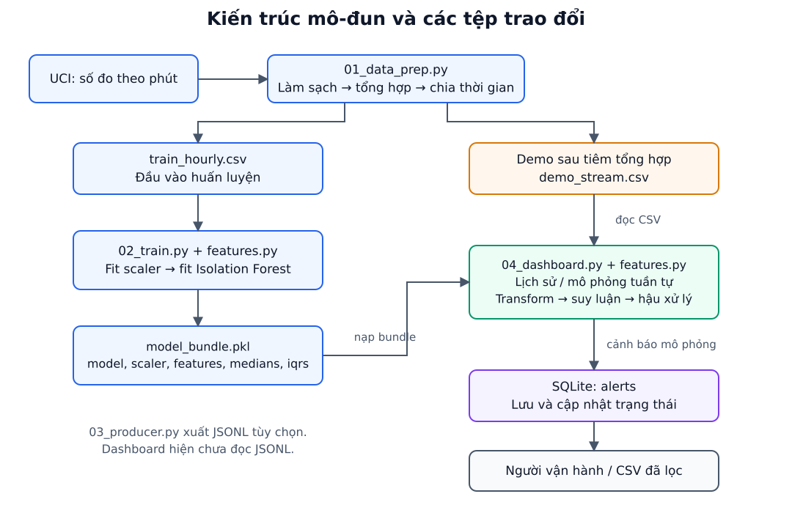

*Hình 3.1 — Kiến trúc mô-đun, artefact và hướng trao đổi dữ liệu. Nguồn: đối chiếu mã nguồn hiện tại của project.*

Việc đặt đặc trưng trong một mô-đun chung tránh chênh lệch công thức giữa huấn luyện và dashboard. Bundle lưu đồng thời `model`, `scaler`, `features`, `medians`, `iqrs`; nhờ đó suy luận dùng đúng thứ tự cột và phần giải thích dùng đúng thống kê nền. CSV giữ dữ liệu đo/nhãn kiểm định, trong khi SQLite chỉ giữ cảnh báo vận hành. Hai loại lưu trữ này có vòng đời khác nhau và không cập nhật lẫn nhau.

## 3.4. Thiết kế đặc trưng và dữ liệu thời gian

Từ các cột gốc `Global_active_power`, `Global_reactive_power`, `Voltage` và timestamp, hệ thống tạo chín đặc trưng theo Bảng 3.3. Các đặc trưng được tính mỗi lần huấn luyện, đánh giá hoặc suy luận rồi đưa vào scaler dưới đúng thứ tự đã lưu.

*Bảng 3.3 — Cấu trúc chín đặc trưng*

| Thứ tự | Tên code | Ý nghĩa và đơn vị trước scale |
|---:|---|---|
| 1 | `hour_sin` | Thành phần sin của giờ, không đơn vị |
| 2 | `hour_cos` | Thành phần cos của giờ, không đơn vị |
| 3 | `is_night` | 1 trong 01:00–05:00, ngược lại 0 |
| 4 | `power_diff_1h` | Công suất hiện tại trừ mẫu trước, kW |
| 5 | `power_dev_24h` | Độ lệch tương đối so với mẫu cách 24 hàng |
| 6 | `power_zscore_6h` | Z-score trong cửa sổ tối đa 6 mẫu |
| 7 | `voltage_diff_1h` | Điện áp hiện tại trừ mẫu trước, V |
| 8 | `voltage_zscore_6h` | Z-score trong cửa sổ tối đa 6 mẫu |
| 9 | `power_factor` | \(P/(\sqrt{P^2+Q^2}+\varepsilon)\), giới hạn [0,1] |

Chu kỳ giờ được mã hóa để 23 giờ và 0 giờ gần nhau trong không gian đặc trưng:

\[
hour\_sin=\sin\left(2\pi\frac{h}{24}\right),\qquad
hour\_cos=\cos\left(2\pi\frac{h}{24}\right). \tag{3.1}
\]

Với \(P_t\) là công suất tác dụng tại hàng \(t\), độ lệch 24 mẫu là:

\[
power\_dev_{24}(t)=\frac{P_t-P_{t-24}}{|P_{t-24}|+\varepsilon},\qquad \varepsilon=10^{-6}. \tag{3.2}
\]

Z-score cửa sổ được tính từ tối đa sáu hàng gần nhất, bao gồm hàng hiện tại:

\[
z^{(6)}_t=\frac{x_t-\bar{x}_{t,6}}{s_{t,6}+\varepsilon}. \tag{3.3}
\]

`pandas.Series.std()` dùng độ lệch chuẩn mẫu; giá trị chưa xác định ở hàng đầu được thay bằng 0 trước khi cộng ε. Tuy nhiên, `power_dev_24h` vẫn thiếu ở 24 hàng đầu. `dropna()` vì thế loại đúng 24 hàng khỏi mỗi chuỗi: 27.334 thành 27.310 và 6.834 thành 6.810. Suy luận tuần tự cần 24 hàng lịch sử và mẫu thứ 25 để tạo vector đầu tiên. Warm-up này không phải dữ liệu bình thường và không được model chấm điểm.

Tên hậu tố `_1h`, `_6h`, `_24h` phản ánh kỳ vọng chuỗi liên tục theo giờ, nhưng code thực tế dùng một, sáu và 24 **hàng**. Train thiếu tổng cộng 182 giờ tại năm khoảng trống; Demo thiếu 239 giờ tại ba khoảng trống. Trong số mẫu hợp lệ, có 120 hàng Train và 72 hàng Demo mà hàng cách 24 vị trí không cách đúng 24 giờ theo timestamp. Do đó, báo cáo gọi đây là độ trễ 24 mẫu.

Hình 3.2 dùng Pearson trên 27.310 mẫu Train để kiểm tra quan hệ tuyến tính. `power_diff_1h` tương quan 0,618 với `power_zscore_6h`; `voltage_diff_1h` tương quan 0,666 với `voltage_zscore_6h`; hai biến động tức thời công suất và điện áp tương quan -0,543. Các hệ số cho thấy có thông tin liên quan nhưng không đồng nghĩa quan hệ nhân quả. Isolation Forest vẫn nhận đủ chín chiều.

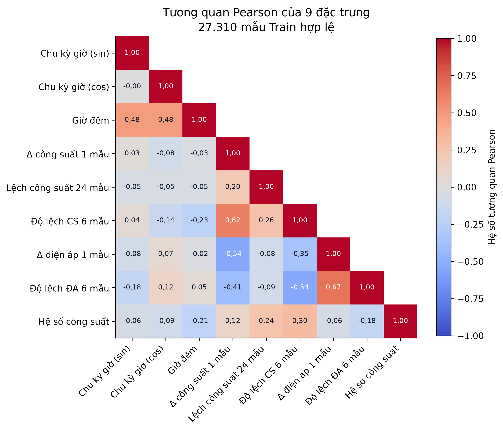

*Hình 3.2 — Tam giác dưới của ma trận tương quan Pearson trên 27.310 mẫu Train. Nhãn tiếng Việt ánh xạ theo thứ tự trong Bảng 3.3. Nguồn: `train_hourly.csv`.*

## 3.5. Luồng suy luận và hậu xử lý

Hình 3.3 đặt hai chế độ cạnh nhau. Phân tích lịch sử tính đặc trưng theo lô trên chuỗi đã chọn, biến đổi toàn bộ ma trận rồi căn kết quả với index hợp lệ. Mô phỏng tuần tự thêm từng hàng vào buffer và chỉ chấm vector mới nhất. Cả hai dùng cùng scaler, model, thứ tự đặc trưng, hàm severity, phân loại gợi ý và thống kê giải thích.

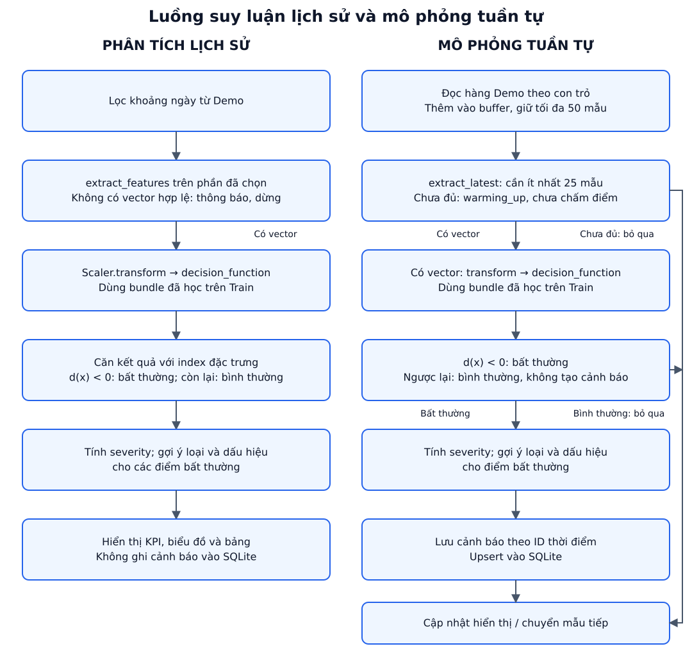

*Hình 3.3 — Luồng suy luận theo lô và theo tuần tự, gồm nhánh warm-up và nhánh tạo cảnh báo. Nguồn: đối chiếu mã nguồn hiện tại của project.*

Quy tắc `classify_type()` được áp dụng theo thứ tự. Nếu `voltage_diff_1h <= -15`, dạng gợi ý là `voltage_drop`. Nếu không, khi `is_night=1` và (`power_zscore_6h > 0,8` hoặc `power_dev_24h > 0,8`), kết quả là `night_spike`. Các cảnh báo còn lại được gợi ý là `power_surge`. Quy tắc ưu tiên giúp một điểm thỏa nhiều điều kiện vẫn nhận một nhãn duy nhất; nó không chứng minh nguyên nhân vật lý.

Phần giải thích tính cho mỗi đặc trưng:

\[
D_j(x)=\frac{|x_j-\operatorname{median}_j|}{IQR_j+\varepsilon}. \tag{3.4}
\]

Ba đặc trưng có \(D_j>0,5\) lớn nhất được hiển thị. Công thức dùng IQR gốc trong `medians`/`iqrs`, không dùng `scale_` đã thay thế trường hợp IQR=0. Với `is_night`, IQR gốc bằng 0 nên nếu giá trị bằng 1 thì độ lệch trở nên rất lớn do mẫu số ε. Điều này có thể đẩy dấu hiệu thời gian lên đầu danh sách; báo cáo xem đây là giới hạn của giải thích heuristic, không phải đóng góp xác suất của mô hình.

## 3.6. Kho cảnh báo và vòng đời

SQLite được chọn vì dashboard cục bộ cần lưu trạng thái qua rerun mà không cần dịch vụ cơ sở dữ liệu riêng. Bảng 3.4 mô tả đúng schema được tạo bởi `init_alert_store()`.

*Bảng 3.4 — Cấu trúc bảng `alerts` trong SQLite*

| Cột | Kiểu/ràng buộc | Ý nghĩa |
|---|---|---|
| `alert_id` | TEXT, khóa chính | ID từ thời điểm dữ liệu, ngăn trùng |
| `data_time` | TEXT, NOT NULL | Thời điểm phép đo |
| `power`, `voltage` | REAL, NOT NULL | Giá trị đo tại cảnh báo |
| `severity` | REAL, NOT NULL | Điểm hiển thị [0,1] |
| `severity_level` | TEXT, NOT NULL | `warning` hoặc `critical` với cảnh báo |
| `anomaly_type` | TEXT, NOT NULL | Dạng gợi ý sau hậu xử lý |
| `explanation` | TEXT, NOT NULL | Tối đa ba dấu hiệu nổi bật |
| `status` | TEXT, mặc định `new` | `new`, `acknowledged` hoặc `closed` |
| `note` | TEXT, mặc định rỗng | Ghi chú người vận hành |
| `acknowledged_at`, `closed_at` | TEXT, nullable | Thời điểm chuyển trạng thái |
| `updated_at` | TEXT, NOT NULL | Lần cập nhật gần nhất |

`save_alert()` dùng `INSERT ... ON CONFLICT(alert_id) DO UPDATE`. Phép cập nhật làm mới dữ liệu mô hình nhưng không xóa trạng thái, ghi chú và thời điểm xử lý đã có. Hình 3.4 cho thấy vòng đời một chiều từ mới đến đã tiếp nhận và đã đóng. Hiện thực cũng cho phép đóng trực tiếp một cảnh báo mới; dashboard không có thao tác mở lại.

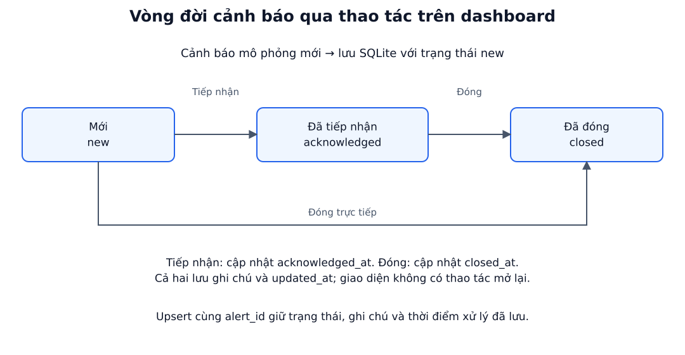

*Hình 3.4 — Vòng đời cảnh báo và các trường thời gian được cập nhật. Nguồn: thiết kế SQLite của đề tài.*

## 3.7. Thiết kế giao diện

Hình 3.5 là wireframe thống nhất của hai chế độ. Chế độ lịch sử đặt bộ lọc ngày và KPI trước biểu đồ, sau đó là bảng cảnh báo để hỗ trợ đi từ tổng quan đến chi tiết. Chế độ mô phỏng đặt điều khiển Play/Pause/Step/Reset và tốc độ trước vùng giám sát; hàng đợi xử lý nằm sau hai biểu đồ công suất và điện áp để người vận hành tập trung vào cảnh báo mở. Cả hai dùng nền sáng cố định trong cấu hình Streamlit và CSS để tránh bảng đổi sang dark theme theo browser.

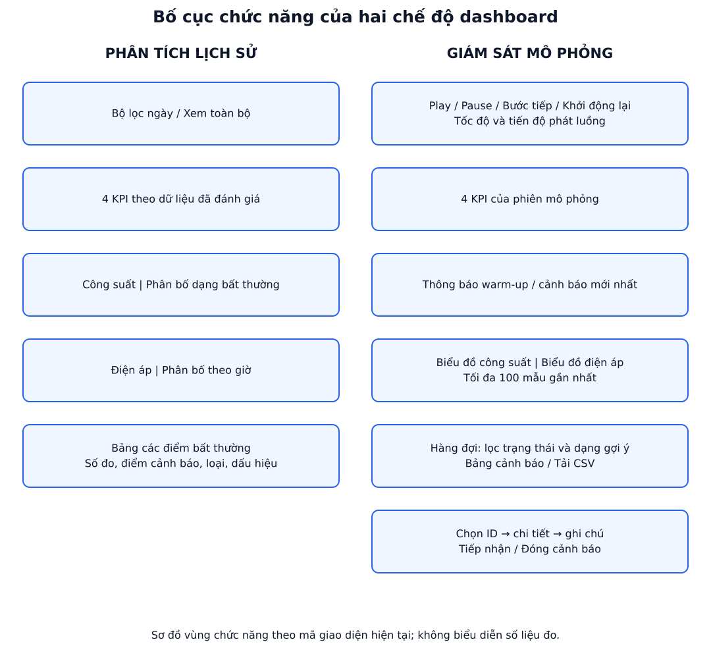

*Hình 3.5 — Wireframe hai chế độ: phân tích lịch sử và giám sát mô phỏng. Nguồn: đối chiếu mã nguồn hiện tại của project.*

Giao diện phân biệt ba trạng thái dữ liệu: `warming_up`, bình thường đã đánh giá và bất thường đã đánh giá. Các ô chưa đủ lịch sử hiển thị thông báo “đang tích lũy đủ 24 mẫu lịch sử”, không đưa vào mẫu số tỷ lệ bình thường. Bảng cảnh báo ưu tiên trạng thái mới, sau đó severity giảm dần và thời điểm dữ liệu. Thiết kế này phục vụ tác vụ xử lý trực tiếp thay vì chỉ trình bày metric mô hình.

---

<a id="chuong-4"></a>

# CHƯƠNG 4: HIỆN THỰC VÀ KIỂM THỬ

## 4.1. Môi trường nghiệm thu

Hệ thống được hiện thực bằng Python, Pandas, NumPy, Scikit-learn và Streamlit. Bảng 4.1 ghi môi trường đã dùng để tái tính số liệu, sinh hình và chạy test ngày 10/09/2026. Đây là môi trường nghiệm thu của phiên bản hiện tại, không phải yêu cầu phần cứng tối thiểu đã được benchmark.

*Bảng 4.1 — Môi trường nghiệm thu*

| Thành phần | Phiên bản/thông số |
|---|---|
| Hệ điều hành | Windows 10, build 10.0.19045 |
| CPU | Intel Core i5-8400 @ 2,80 GHz, 6 logical CPU |
| RAM | 31,92 GiB |
| Python | 3.14.3 |
| Pandas / NumPy | 3.0.5 / 2.5.3 |
| Scikit-learn / Joblib | 1.9.0 / 1.6.0 |
| Streamlit / Plotly | 1.63.0 / 7.0.0 |
| Matplotlib | 3.11.1 |

## 4.2. Cấu trúc mã nguồn

Các tệp được tách theo bước dữ liệu, huấn luyện, suy luận và kiểm thử. Cấu trúc chính như sau:

```text
Smart-meter-anomaly/
├── data/
│   ├── household_power_consumption.txt
│   ├── train_hourly.csv
│   ├── demo_stream.csv
│   └── alert_history.sqlite3
├── models/model_bundle.pkl
├── src/
│   ├── 01_data_prep.py
│   ├── 02_train.py
│   ├── 03_producer.py
│   ├── 04_dashboard.py
│   ├── config.py
│   ├── features.py
│   └── style.css
├── scripts/
│   ├── generate_report_figures.py
│   ├── report_diagrams.py
│   └── collect_report_evidence.py
├── tests/
└── reports/figures/
```

`config.py` tập trung đường dẫn, thứ tự đặc trưng, ngưỡng và nhãn hiển thị. `features.py` không đọc tệp; nó nhận DataFrame và trả DataFrame/Series đặc trưng, nên có thể dùng lại trong train, dashboard và test. `01_data_prep.py` cùng `02_train.py` là các lệnh batch. `04_dashboard.py` quản lý trạng thái phiên, suy luận và SQLite. `03_producer.py` cung cấp luồng console riêng, không phải thành phần bắt buộc của dashboard.

## 4.3. Hiện thực đặc trưng, huấn luyện và cảnh báo

Đoạn mã 4.1 trích phần cốt lõi của `extract_features()`. Hàm sao chép DataFrame trước khi thêm cột, nhờ đó TC04–TC07 có thể biến đổi dữ liệu trong bộ nhớ mà không ghi đè CSV.

*Đoạn mã 4.1 — Tạo các đặc trưng độ trễ và cửa sổ*

```python
df = df.copy()
df["power_diff_1h"] = df[TARGET_COL] - df[TARGET_COL].shift(1)
power_lag_24h = df[TARGET_COL].shift(24)
df["power_dev_24h"] = (
    df[TARGET_COL] - power_lag_24h
) / (power_lag_24h.abs() + _EPS)

p_rmean = df[TARGET_COL].rolling(window=6, min_periods=1).mean()
p_rstd = df[TARGET_COL].rolling(window=6, min_periods=1).std().fillna(0)
df["power_zscore_6h"] = (df[TARGET_COL] - p_rmean) / (p_rstd + _EPS)
df["voltage_diff_1h"] = df["Voltage"] - df["Voltage"].shift(1)
return df[ENGINEERED_FEATURE_NAMES].dropna()
```

Sau khi đặc trưng được tạo, Đoạn mã 4.2 thể hiện ranh giới học: `fit_transform` và `fit` chỉ nhận Train. Bundle đóng gói các thành phần cần thiết để dashboard không phải huấn luyện lại.

*Đoạn mã 4.2 — Khớp scaler/model và tạo bundle*

```python
df_train_feats = extract_features(df_train)
scaler = RobustScaler()
X_train = scaler.fit_transform(
    df_train_feats[ENGINEERED_FEATURE_NAMES].values
)
model = IsolationForest(
    n_estimators=200,
    max_samples=512,
    max_features=1.0,
    contamination=0.08,
    random_state=42,
    n_jobs=-1,
)
model.fit(X_train)
medians, iqrs = calc_baseline_stats(df_train_feats)
bundle = {"model": model, "scaler": scaler, "features":
          ENGINEERED_FEATURE_NAMES, "medians": medians, "iqrs": iqrs}
joblib.dump(bundle, MODEL_BUNDLE_PATH)
```

Đoạn mã 4.3 cho thấy cách lưu idempotent. Khóa chính ngăn cùng thời điểm luồng tạo nhiều dòng, còn mệnh đề cập nhật không ghi đè `status` hay `note`.

*Đoạn mã 4.3 — Lưu cảnh báo không tạo bản ghi trùng*

```python
conn.execute("""
    INSERT INTO alerts (
        alert_id, data_time, power, voltage, severity,
        severity_level, anomaly_type, explanation, updated_at
    ) VALUES (?, ?, ?, ?, ?, ?, ?, ?, ?)
    ON CONFLICT(alert_id) DO UPDATE SET
        power=excluded.power,
        voltage=excluded.voltage,
        severity=excluded.severity,
        severity_level=excluded.severity_level,
        anomaly_type=excluded.anomaly_type,
        explanation=excluded.explanation,
        updated_at=excluded.updated_at
""", values)
conn.commit()
```

## 4.4. Chuẩn bị dữ liệu và thiết kế thực nghiệm

Dữ liệu gốc được đọc với dấu phân cách `;`; ký hiệu `?` được xem là thiếu. Các cột đo được đổi sang số, hàng thiếu toàn bộ bị bỏ, giá trị còn thiếu được điền tiến/lùi, timestamp trùng giữ bản ghi đầu. Chuỗi sau đó được lấy trung bình theo từng giờ bằng `resample("h").mean().dropna()`. Việc chia 80/20 dùng vị trí thời gian, không xáo trộn, nên Demo luôn nằm sau Train.

CSV theo giờ vẫn giữ các phép đo gốc như công suất tác dụng, công suất phản kháng, điện áp và ba kênh sub-metering. Chín đặc trưng không được ghi thêm vào hai CSV. Cách hiện thực này tránh lưu song song nhiều phiên bản đặc trưng, nhưng yêu cầu mọi consumer phải gọi đúng mô-đun `features.py`. Trường nhãn `is_anomaly` và `anomaly_type` chỉ có trong Demo sau tiêm. Khi `02_train.py` đọc Train, hàm đặc trưng chỉ dùng cột đo và index thời gian; không tồn tại cột nhãn để mô hình học.

Phép điền tiến rồi điền lùi xử lý ô thiếu bên trong chuỗi nhưng không tạo lại các timestamp mà cả giờ bị thiếu. Vì `resample(...).dropna()` bỏ giờ không có quan sát, chuỗi đầu ra còn các khoảng nhảy đã thống kê ở Chương 3. Việc nêu rõ bước này giúp phân biệt hai vấn đề: thiếu giá trị trong một hàng đã có và thiếu hoàn toàn một hàng thời gian. Pipeline hiện tại xử lý vấn đề thứ nhất, còn semantics lag theo thời gian của vấn đề thứ hai vẫn là hạn chế.

Hình 4.1 trình bày đồng thời trục thời gian và số lượng qua từng bước. Train gồm 27.334 dòng, sau warm-up còn 27.310 mẫu và chỉ dùng học scaler/model. Demo gồm 6.834 dòng; hàm tiêm tạo 546 điểm trước warm-up. Khi đặc trưng loại 24 hàng đầu, còn 6.810 mẫu và 545 nhãn tiêm. Một `night_spike` nằm trong vùng warm-up nên không có vector đầu vào và không tham gia metric.

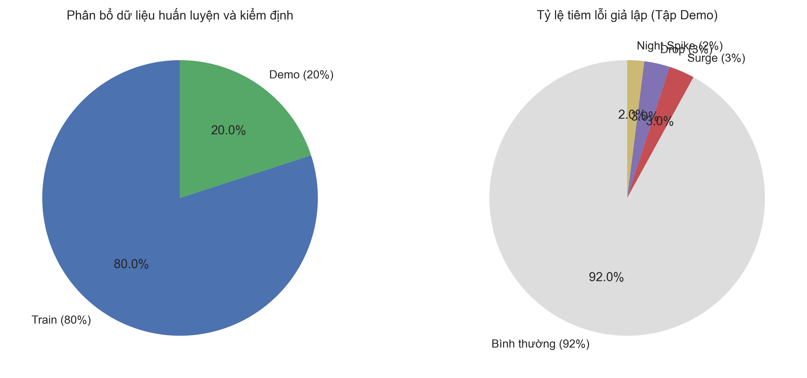

*Hình 4.1 — Timeline Train/Demo và số lượng qua bước đặc trưng, tiêm nhãn, huấn luyện, đánh giá. Nguồn: các CSV và pipeline của đề tài.*

Hàm tiêm luôn thao tác trên `df_demo.copy()` và dùng `numpy.random.default_rng(42)`. Các nhóm được chọn không thay thế; nhóm điện áp lấy từ hàng chưa mang nhãn, còn nhóm ban đêm tiếp tục lọc hàng chưa mang nhãn. Vì vậy, ba nhãn không chồng nhau. Tổng tỷ lệ danh nghĩa 8% được dùng làm căn cứ thực nghiệm cho `contamination=0,08` như đã giải thích tại Mục 2.4. Bảng 4.2 phân biệt tỷ lệ yêu cầu, miền chọn và số lượng thực tế.

*Bảng 4.2 — Cấu hình tiêm ba kịch bản tổng hợp*

| Kịch bản | Miền chọn và phép thay đổi | Trước warm-up | Trong 6.810 mẫu hợp lệ |
|---|---|---:|---:|
| `power_surge` | Giờ 08:00–22:00; nhân công suất 3,0–5,0 | 205 | 205 |
| `voltage_drop` | Hàng chưa gán nhãn; trừ điện áp 20–40 V | 205 | 205 |
| `night_spike` | Giờ 01:00–05:00, hàng chưa gán nhãn; nhân công suất 2,0–3,5 | 136 | 135 |
| Tổng | Các index không chồng nhau, seed 42 | 546 | 545 |

Train không nhận ba phép tiêm này. Riêng TC07 lấy bản sao 1.000 dòng đầu của Train và gọi hàm tiêm hai lần để kiểm thử tính tái lập; DataFrame thử nghiệm đó không được lưu và không tham gia `model.fit()`.

## 4.5. Tích hợp dashboard

Ở chế độ lịch sử, dashboard gọi `extract_features()` trên DataFrame Demo, `scaler.transform()`, rồi `model.decision_function()`. Kết quả được căn theo index đặc trưng để nhãn tiêm và phép đo cùng thời điểm. Bộ lọc ngày chỉ điều chỉnh phạm vi trình bày. KPI gồm tổng mẫu đã đánh giá, tỷ lệ bình thường, số bất thường và severity cao nhất; các mẫu warm-up được loại khỏi phép tính.

Bundle được nạp bằng `st.cache_resource`, còn Demo được nạp bằng `st.cache_data`. Cơ chế cache giảm thao tác đọc lặp khi widget làm Streamlit rerun, đồng thời không làm thay đổi tham số mô hình. Khi bundle hoặc Demo không tồn tại, `main()` hiển thị lỗi và dừng nhánh xử lý. Khi khoảng ngày không có mẫu hợp lệ, giao diện hiển thị thông báo riêng. Những trạng thái này ngăn dashboard thay thế dữ liệu thiếu bằng một tỷ lệ “bình thường” gây hiểu nhầm.

Biểu đồ lịch sử đánh dấu điểm cảnh báo trên chuỗi công suất và điện áp để người dùng đọc cảnh báo trong bối cảnh lân cận. Bảng chỉ nhận các hàng có dự đoán bất thường và trình bày thời gian, công suất, điện áp, điểm cảnh báo, dạng gợi ý, dấu hiệu nổi bật. Do lịch sử không ghi vào kho xử lý, người dùng có thể khảo sát lại toàn bộ Demo mà không làm tăng hàng đợi SQLite. Sự tách biệt này ngăn một lần đổi bộ lọc tạo hàng loạt bản ghi vận hành.

Ở chế độ mô phỏng, `_step_stream_engine()` đọc từng hàng theo con trỏ. Buffer giữ tối đa 50 mẫu, đủ cho độ trễ lớn nhất 24 hàng. Một event chỉ được tạo khi đã đánh giá và \(d(x)<0\). `rt_event_keys` chống lặp trong phiên, còn khóa chính SQLite chống lặp giữa các lần ghi. Sau khi lưu, `render_alert_queue()` đọc toàn bộ kho, lọc theo trạng thái/dạng gợi ý, sắp xếp cảnh báo mới trước, và cung cấp nút tiếp nhận, đóng, ghi chú, xuất CSV.

Khi khởi tạo hoặc reset, engine nạp 30 hàng đầu để giao diện có sẵn 24 hàng warm-up và sáu hàng đã đánh giá. AppTest xác nhận chính xác cấu trúc này. Play và Step chỉ thay đổi con trỏ và dữ liệu phiên; model bundle không bị sửa. Khi con trỏ tới cuối Demo, trạng thái phát được dừng. Reset làm rỗng buffer, vùng hiển thị và khóa sự kiện trong session rồi phát lại 30 hàng, trong khi lịch sử xử lý ở SQLite vẫn tồn tại theo mục tiêu lưu bền.

Hàng đợi dùng hai multiselect cho trạng thái và dạng gợi ý. Sau lọc, dữ liệu được sắp theo `new`, `acknowledged`, `closed`, tiếp đến severity giảm dần. Selectbox xác định một `alert_id` để hiển thị bốn metric đo, mô tả dấu hiệu và ghi chú. Nút tiếp nhận đặt `acknowledged_at`; nút đóng đặt `closed_at`; `updated_at` được cập nhật trong cả hai trường hợp. CSV xuất ra chính phần đang lọc, giúp người vận hành chuyển danh sách sang quy trình báo cáo ngoài dashboard.

Giao diện được đặt `base="light"` trong cả cấu hình khởi chạy gốc và cấu hình khi chạy từ `src`. CSS khai báo `color-scheme: only light` và màu nền/chữ cụ thể cho DataFrame, multiselect, selectbox, menu, input và nút. Điều này xử lý trường hợp browser đang ở dark theme. Bằng chứng tự động gồm test tải cấu hình theme từ nhiều thư mục chạy và AppTest kiểm tra bảng, bộ lọc, selectbox, text area cùng nút tải xuất hiện mà không ghi vào SQLite thật.

Hai lớp theme có vai trò khác nhau. Cấu hình `.streamlit/config.toml` định nghĩa palette gốc trước khi trang được render. CSS xử lý các widget có DOM riêng và đặt cả màu của trạng thái hover/focus để lựa chọn vẫn đọc được. Test phụ trợ chạy từ hai thư mục khởi động nhằm phát hiện trường hợp Streamlit đọc nhầm cấu hình tương đối. Test hàng đợi thay `ALERT_DB_PATH` trước khi gọi hàm giao diện, vì vậy thao tác kiểm tra component không chạm vào `data/alert_history.sqlite3`.

## 4.6. Chiến lược kiểm thử

Mười test nghiệp vụ ưu tiên ranh giới có rủi ro cao: warm-up, đúng công thức, phân loại gợi ý, severity, tiêm dữ liệu, vòng đời SQLite, dashboard và pipeline mô hình. Chúng đọc đường dẫn từ gốc project thay vì phụ thuộc thư mục hiện hành. Test biến đổi dùng bản sao; test lưu trữ dùng `TemporaryDirectory`; test dashboard thay đường dẫn kho bằng SQLite tạm. Nếu thiếu Train, Demo hoặc bundle, helper báo rõ artefact còn thiếu.

TC01–TC06 là unit test vì mỗi ca tập trung vào một hợp đồng hàm. TC03 tự tính năm đặc trưng từ phép đo UCI thay vì gọi lại cùng công thức để tạo expected. TC06 lấy score thật từ 1.000 dòng đầu Demo, sau đó kiểm tra miền giá trị, chiều đơn điệu và các mốc phân cấp. TC07 kiểm tra cả index, tỷ lệ nhân/trừ và không chồng nhãn; nhờ vậy seed giống nhau nhưng sai miền giờ vẫn bị phát hiện.

TC08–TC10 là integration test. TC08 đi qua câu lệnh tạo bảng, upsert và update trạng thái trong một thư mục tạm. TC09 chạy toàn bộ `main()` bằng Streamlit AppTest, chuyển qua hai chế độ và kiểm tra 24/30 record đầu là warm-up với `is_anomaly=None`. TC10 chạy toàn bộ Demo qua extractor, scaler và model, rồi đối chiếu số mẫu/nhãn chính xác cùng khoảng metric. Khoảng AUC 0,91–0,94 và Recall 0,70–0,75 cho phép chênh lệch số thực nhỏ giữa phiên bản thư viện, trong khi confusion matrix vẫn phải có tổng 6.810.

Lần nghiệm thu chạy lệnh `python -m unittest discover -s tests -p "test_*.py" -v`. Kết quả thực tế là 12/12 test đạt trong 8,305 giây: mười test nghiệp vụ trong Bảng 4.3 và hai test light theme. Cảnh báo `missing ScriptRunContext` xuất hiện khi AppTest chạy ở bare mode nhưng không tạo exception và không làm test thất bại.

*Bảng 4.3 — Kết quả mười test nghiệp vụ dùng dữ liệu UCI*

| Mã | Cấp | Đầu vào | Kết quả mong đợi | Kết quả thực tế | Trạng thái |
|---|---|---|---|---|---|
| TC01 | Unit | 24 dòng đầu Train | `extract_latest()` trả `None` | Trả `None` | Đạt |
| TC02 | Unit | 25 dòng đầu Train | Đủ 9 đặc trưng đúng thứ tự, không NaN | 9/9 đúng thứ tự, không NaN | Đạt |
| TC03 | Unit | Đoạn Train liên tiếp | Năm công thức khớp phép tính độc lập | Các giá trị khớp trong sai số số thực | Đạt |
| TC04 | Unit | Bản sao mẫu có `voltage_diff_1h <= -15` | Ưu tiên `voltage_drop` | Trả `voltage_drop` | Đạt |
| TC05 | Unit | Mẫu UCI trong/ngoài giờ đêm | Lần lượt `night_spike`/`power_surge` | Hai `subTest` trả đúng | Đạt |
| TC06 | Unit | Score thật trên đoạn Demo | Severity trong [0,1], đơn điệu và đúng cấp | Tất cả điều kiện đúng | Đạt |
| TC07 | Unit | Hai bản sao 1.000 dòng Train, seed 42 | Vị trí/giá trị/nhãn giống nhau; không chồng | Mỗi lần 80 nhãn: 30/30/20, giống nhau | Đạt |
| TC08 | Integration | Một cảnh báo thật và SQLite tạm | Lưu, tiếp nhận, ghi chú, đóng; không trùng ID | Một dòng, trạng thái/ghi chú đúng | Đạt |
| TC09 | Integration/UI | AppTest hai chế độ, Demo và SQLite tạm | Không exception; đúng warm-up và đủ điều khiển | Hai chế độ chạy, thành phần xuất hiện | Đạt |
| TC10 | Integration | Toàn bộ Demo và bundle | 6.810 mẫu, 545 nhãn, metric trong ngưỡng | AUC 0,923131; Recall 0,728440; tổng CM 6.810 | Đạt |

TC01–TC03 bảo vệ nguyên nhân mất 24 hàng và thứ tự đặc trưng. TC04–TC06 bảo vệ ba tầng hậu xử lý. TC07 kiểm tra hàm chuẩn bị dữ liệu mà không biến dữ liệu kiểm thử thành dữ liệu huấn luyện. TC08–TC10 kiểm tra luồng tích hợp từ artefact tới UI và metric. Hai test theme là kiểm tra phụ trợ, không được tính vào mười test nghiệp vụ.

---

<a id="chuong-5"></a>

# CHƯƠNG 5: KẾT QUẢ, ĐÁNH GIÁ VÀ KẾT LUẬN

## 5.1. Kết quả tổng thể

Kết quả được tính trên 6.810 mẫu Demo đủ đặc trưng. Nhãn dương gồm 545 điểm được tiêm tổng hợp; nhãn âm gồm 6.265 điểm không được tiêm. Model dự đoán 764 điểm bất thường tại ngưỡng \(d(x)<0\). Bảng 5.1 tổng hợp các chỉ số từ cùng một lần tính, tránh trộn kết quả giữa các phiên bản dữ liệu hoặc bundle.

*Bảng 5.1 — Chỉ số đánh giá tổng thể trên Demo hợp lệ*

| Chỉ số | Kết quả |
|---|---:|
| Số mẫu đánh giá | 6.810 |
| Nhãn tiêm tổng hợp | 545 |
| Cảnh báo của mô hình | 764 |
| ROC-AUC với \(-d(x)\) | 0,923131 |
| Accuracy | 92,44% |
| Precision | 51,96% |
| Recall | 72,84% |
| F1-score | 60,66% |

ROC-AUC 0,923131 cho thấy score liên tục xếp hạng phần lớn điểm tiêm cao hơn điểm không tiêm. Hình 5.1 thể hiện đường ROC với 545 mẫu dương và 6.265 mẫu âm. Đường chéo là mức xếp hạng ngẫu nhiên; nó không phải ngưỡng đang dùng trên dashboard.

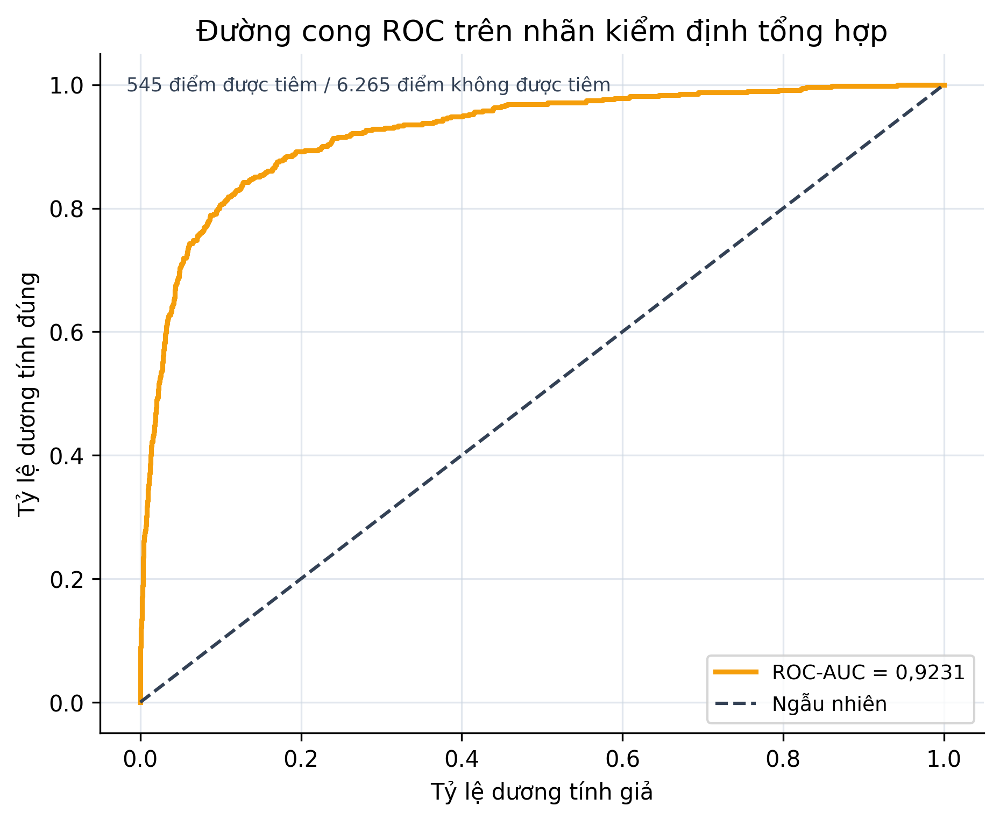

*Hình 5.1 — ROC tính bằng `roc_curve(y_true, -decision_function)`, nhãn dương là nhãn tiêm tổng hợp. Nguồn: Demo và model bundle hiện tại.*

Accuracy cao một phần do lớp không tiêm chiếm 92,00% dữ liệu. Recall 72,84% nghĩa là phát hiện 397/545 điểm tiêm, còn Precision 51,96% nghĩa là 397/764 cảnh báo trùng nhãn tiêm. Vì dữ liệu nền không có nhãn sự cố chuyên gia, 367 cảnh báo ngoài nhãn tiêm không thể được khẳng định là sai ngoài đời thực.

Hình 5.2 chuẩn hóa màu theo từng hàng để tách hai câu hỏi. Trong 6.265 điểm không tiêm, 5.898 điểm được dự đoán bình thường và 367 điểm tạo cảnh báo. Trong 545 điểm được tiêm, 397 điểm được phát hiện và 148 điểm bị bỏ sót. Tổng bốn ô bằng 6.810.

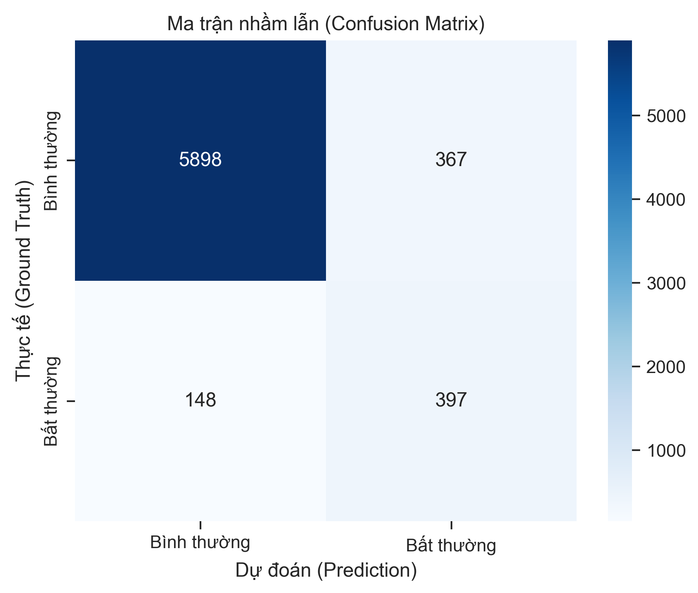

*Hình 5.2 — Ma trận nhầm lẫn `[[5898, 367], [148, 397]]`, chuẩn hóa màu theo nhãn thực nghiệm. “FP” được diễn giải là cảnh báo ngoài nhãn tiêm. Nguồn: Demo và model bundle hiện tại.*

## 5.2. Kết quả theo kịch bản

Recall khác rõ giữa ba phép tiêm. Sụt điện áp đạt 193/205, tương đương 94,15%, vì phép trừ 20–40 V tạo tín hiệu trực tiếp trên `voltage_diff_1h` và `voltage_zscore_6h`. Đột biến công suất ban ngày đạt 127/205, tương đương 61,95%. Đột biến đêm đạt 77/135, tương đương 57,04%. Hình 5.3 thêm cột tổng thể 397/545 để liên hệ từng nhóm với Recall chung.

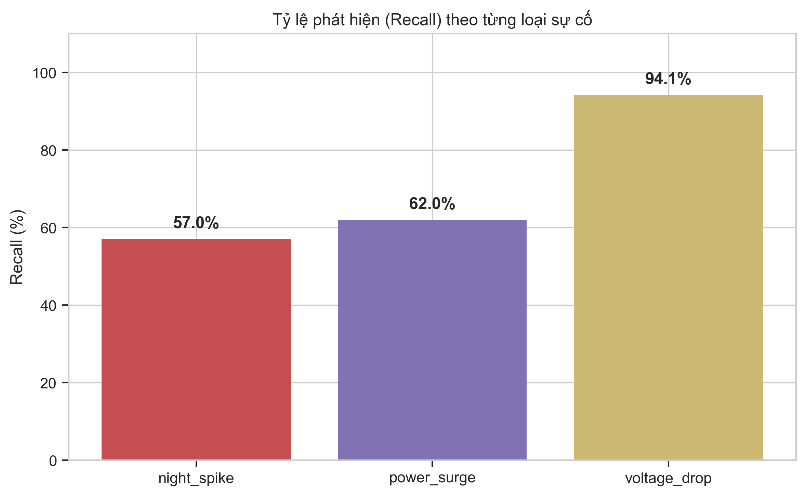

*Hình 5.3 — Recall theo kịch bản tổng hợp và tổng thể: 127/205, 193/205, 77/135 và 397/545. Nguồn: Demo và model bundle hiện tại.*

Kết quả không chứng minh mô hình “hiểu” tên kịch bản. Isolation Forest chỉ quan sát độ hiếm trong chín chiều. Kịch bản sụt áp tạo một độ lệch lớn so với IQR Train nên dễ cô lập. Hai kịch bản công suất nhân giá trị nền; khi nền ban đầu thấp, giá trị sau nhân vẫn có thể nằm gần miền quan sát thông thường. Như đã giải thích tại Mục 2.4, `contamination=0,08` được chọn để tỷ lệ bất thường kỳ vọng trên Train gần với tổng tỷ lệ tiêm danh nghĩa 8% của Demo. Sự tương ứng này chỉ là một điều kiện của protocol thực nghiệm; nó không làm cho phân phối theo thời gian và độ mạnh của ba kịch bản trở nên giống phân phối các điểm hiếm trên Train.

## 5.3. Phân tích ba trường hợp cụ thể

Ba trường hợp được chọn bằng quy tắc có thể tái lập: thời điểm sớm nhất trong nhóm TP, FN và FP theo nhãn tổng hợp. Các giá trị dưới đây được tính lại từ CSV và bundle; phần quan sát được tách khỏi giả thuyết nguyên nhân.

**TP — 06/02/2010 09:00, `voltage_drop`.** Quan sát: điện áp là 206,428 V; `voltage_diff_1h=-32,880` V và `voltage_zscore_6h=-2,025`. Score \(d(x)=-0,007995\) nằm vừa phía cảnh báo, nên điểm tiêm được phát hiện. Công suất là 1,627 kW và `power_diff_1h=0,163` kW. Dữ liệu cho thấy hai đặc trưng điện áp lệch mạnh và cùng hướng. Giả thuyết hợp lý là phép tiêm điện áp đã tạo đường đi ngắn trong các cây dùng các chiều này; không thể suy ra cây nào đóng góp bao nhiêu từ chuỗi giải thích heuristic hiện tại.

**FN — 08/02/2010 03:00, `night_spike`.** Quan sát: công suất sau tiêm là 0,854 kW; `power_diff_1h=0,558` kW, `power_dev_24h=0,811`, `power_zscore_6h=0,526` và `is_night=1`. Score \(d(x)=0,020665\) vẫn ở phía bình thường. Đây là trường hợp mức tăng tương đối đủ thỏa quy tắc gợi ý đột biến đêm nếu có cảnh báo, nhưng vector chín chiều chưa hiếm đủ theo rừng. Giả thuyết cần kiểm tra thêm là công suất nền thấp làm giá trị tuyệt đối sau nhân còn nằm trong miền tải thường gặp, trong khi các chiều điện áp và hệ số công suất không tăng độ cô lập.

**FP theo nhãn tổng hợp — 06/02/2010 10:00.** Quan sát: hàng này mang nhãn `normal` nhưng có \(d(x)=-0,020241\). Công suất là 2,580 kW, `power_diff_1h=0,953` kW, điện áp 236,992 V và `voltage_diff_1h=+30,563` V. Nó đứng ngay sau điểm sụt áp được tiêm lúc 09:00, nên phép sai phân dùng mẫu trước vẫn chịu ảnh hưởng của thao tác tiêm. Trường hợp này cho thấy nhãn chỉ đánh dấu hàng bị sửa, trong khi đặc trưng độ trễ có thể truyền ảnh hưởng sang hàng kế tiếp. Vì vậy, gọi đây là “cảnh báo ngoài nhãn tiêm” chính xác hơn “cảnh báo sai”; một protocol theo cửa sổ sự kiện có thể đánh giá công bằng hơn cho đặc trưng sai phân.

Ba ví dụ giải thích hai thành phần của sai số. Một phần đến từ độ mạnh và bối cảnh của phép tiêm. Phần còn lại đến từ cách đặt nhãn theo một timestamp trong khi vector đặc trưng phụ thuộc nhiều hàng. Phân tích này cũng cho thấy lý do không dùng ba quy tắc hậu xử lý làm ground truth của model.

## 5.4. Đối chiếu mục tiêu

Bảng 5.2 truy vết các mục tiêu ở Chương 1 tới bằng chứng hiện thực. “Đạt” chỉ dùng khi có artefact hoặc test tương ứng.

*Bảng 5.2 — Đối chiếu kết quả với mục tiêu*

| Mã | Bằng chứng | Đánh giá |
|---|---|---|
| MT01 | Chia thời gian 27.334/6.834; tiêm chỉ ở Demo; hash Train/Demo/bundle không đổi sau nghiệm thu | Đạt |
| MT02 | Bundle lưu đúng 9 tên; TC01–TC03 kiểm tra warm-up, thứ tự và công thức | Đạt |
| MT03 | ROC-AUC 0,923131 > 0,90; Recall 72,84% > 70% | Đạt trên nhãn tổng hợp |
| MT04 | Dashboard có hai chế độ; TC08–TC09 kiểm tra SQLite, bộ lọc, chi tiết, nút xử lý và tải CSV | Đạt |
| MT05 | 10/10 test nghiệp vụ và 2/2 test theme đạt | Đạt |

MT03 cần được giới hạn theo protocol đã công bố. Việc vượt ngưỡng mục tiêu không đồng nghĩa mô hình đã đạt Recall tương tự trên lỗi thực hoặc trên hộ khác. Tương tự, MT04 xác nhận chức năng phần mềm trong AppTest và chạy cục bộ, chưa phải đánh giá usability với người vận hành thực tế.

## 5.5. Hạn chế và hướng phát triển

Các hướng phát triển trong Bảng 5.3 được ghép trực tiếp với hạn chế đo được, thay vì mở rộng chung chung.

*Bảng 5.3 — Hạn chế và hướng phát triển tương ứng*

| Hạn chế hiện tại | Bằng chứng | Hướng phát triển ưu tiên |
|---|---|---|
| Nhãn chỉ là kịch bản tổng hợp | Không có xác nhận sự cố chuyên gia trong UCI | Thu thập sự kiện có xác minh; xây protocol huấn luyện/kiểm định ngoài thời gian |
| Một hộ gia đình | Toàn bộ Train/Demo thuộc cùng nguồn | Đánh giá nhiều hộ, nhiều mùa và thiết bị; báo cáo độ ổn định giữa nhóm |
| Độ trễ dùng số hàng | 120 mẫu Train và 72 mẫu Demo có lag 24 hàng khác 24 giờ | Tái lập lưới giờ hoặc join theo timestamp trước khi tính lag |
| Nhãn điểm không bao phủ ảnh hưởng độ trễ | FP đầu tiên là hàng sau điểm tiêm điện áp | Đánh giá theo cửa sổ sự kiện và quy định vùng dung sai thời gian |
| Recall kịch bản công suất còn thấp | `power_surge` 61,95%; `night_spike` 57,04% | Hiệu chỉnh ngưỡng trên validation theo thời gian; bổ sung đặc trưng bền vững và so sánh mô hình |
| Severity chưa hiệu chuẩn | Công thức sigmoid cố định hệ số 30 | Hiệu chuẩn trên nhãn chuyên gia hoặc đổi tên thành mức ưu tiên thuần túy |
| Giải thích median/IQR thiên lệch với biến nhị phân | `is_night` có IQR=0 | Tách giải thích biến nhị phân; dùng phân tích đường đi/counterfactual thích hợp |
| Chưa có so sánh thực nghiệm | Không có ablation scaler hay baseline cùng protocol | So sánh Isolation Forest không scale, LOF, One-Class SVM và autoencoder trên cùng split |
| Dashboard chạy cục bộ | SQLite và mô phỏng từ CSV | Thêm ingest thật, phân quyền, audit log, giám sát drift và cơ chế retrain |

Concept drift là rủi ro khi hành vi tiêu thụ thay đổi theo mùa, thiết bị hoặc hộ sử dụng [9]. Phiên bản tiếp theo nên theo dõi phân phối đặc trưng và tỷ lệ cảnh báo theo cửa sổ, nhưng chỉ retrain sau khi có quy trình phê duyệt và lưu phiên bản bundle. Trước khi mở rộng mô hình sâu, cần sửa semantics thời gian và protocol nhãn sự kiện vì hai yếu tố này ảnh hưởng trực tiếp tính đúng của mọi so sánh.

## 5.6. Kết luận

Đồ án đã xây dựng một pipeline đầu cuối từ dữ liệu UCI tới dashboard xử lý cảnh báo. RobustScaler và Isolation Forest chỉ học từ 27.310 mẫu Train; 6.810 mẫu Demo cùng 545 nhãn tiêm được giữ cho đánh giá. Model bundle hiện tại đạt ROC-AUC 0,923131, Recall 72,84% và tạo 764 cảnh báo. Kết quả tốt nhất thuộc về kịch bản sụt điện áp; hai kịch bản công suất cho thấy dư địa cải thiện.

Giá trị chính của hệ thống nằm ở tính nhất quán giữa huấn luyện và suy luận, khả năng tái lập số liệu, phân biệt rõ dự đoán với hậu xử lý, và vòng đời cảnh báo có lưu trữ. Mười test nghiệp vụ cùng hai test theme bảo vệ các ranh giới quan trọng. Phạm vi kết luận vẫn là phát hiện kịch bản tổng hợp trên dữ liệu một hộ gia đình. Bước tiếp theo có giá trị nhất là chuẩn hóa trục thời gian, xây nhãn sự kiện có xác minh và so sánh các mô hình trên cùng protocol.

---

<a id="tai-lieu-tham-khao"></a>

# TÀI LIỆU THAM KHẢO

[1] G. Hebrail and A. Berard, “Individual Household Electric Power Consumption,” UCI Machine Learning Repository, 2012. doi: 10.24432/C58K54.

[2] V. Chandola, A. Banerjee, and V. Kumar, “Anomaly Detection: A Survey,” *ACM Computing Surveys*, vol. 41, no. 3, art. 15, 2009. doi: 10.1145/1541880.1541882.

[3] F. T. Liu, K. M. Ting, and Z.-H. Zhou, “Isolation Forest,” in *Proc. 8th IEEE International Conference on Data Mining*, 2008, pp. 413–422. doi: 10.1109/ICDM.2008.17.

[4] F. T. Liu, K. M. Ting, and Z.-H. Zhou, “Isolation-Based Anomaly Detection,” *ACM Transactions on Knowledge Discovery from Data*, vol. 6, no. 1, art. 3, 2012. doi: 10.1145/2133360.2133363.

[5] J. Wang, C. Gu, and K. Liu, “Anomaly electricity detection method based on entropy weight method and isolated forest algorithm,” *Frontiers in Energy Research*, vol. 10, 2022. doi: 10.3389/fenrg.2022.984473.

[6] W. Dai, X. Liu, A. Heller, and P. S. Nielsen, “Smart Meter Data Anomaly Detection using Variational Recurrent Autoencoders with Attention,” arXiv:2206.07519, 2022. doi: 10.48550/arXiv.2206.07519.

[7] Scikit-learn Developers, “RobustScaler,” *Scikit-learn API Reference*. [Online]. Available: https://scikit-learn.org/stable/modules/generated/sklearn.preprocessing.RobustScaler.html. [Accessed: Sep. 10, 2026].

[8] Scikit-learn Developers, “IsolationForest,” *Scikit-learn API Reference*. [Online]. Available: https://scikit-learn.org/stable/modules/generated/sklearn.ensemble.IsolationForest.html. [Accessed: Sep. 10, 2026].

[9] J. Gama, I. Žliobaitė, A. Bifet, M. Pechenizkiy, and A. Bouchachia, “A Survey on Concept Drift Adaptation,” *ACM Computing Surveys*, vol. 46, no. 4, art. 44, 2014. doi: 10.1145/2523813.

---

<a id="phu-luc"></a>

# PHỤ LỤC

## Phụ lục A. Cài đặt và vận hành

Từ thư mục gốc project, cài thư viện và chuẩn bị dữ liệu:

```powershell
python -m pip install -r requirements.txt
python src/01_data_prep.py
python src/02_train.py
```

Khởi chạy dashboard:

```powershell
python -m streamlit run src/04_dashboard.py
```

Chạy toàn bộ test:

```powershell
python -m unittest discover -s tests -p "test_*.py" -v
```

Tái tạo bằng chứng và hình:

```powershell
python scripts/collect_report_evidence.py
python scripts/generate_report_figures.py
```

`generate_report_figures.py` đọc trực tiếp Train, Demo và bundle; script kiểm tra số mẫu, nhãn, thứ tự đặc trưng, tham số model và metric trước khi ghi 10 PNG ở 300 DPI cùng bốn sơ đồ SVG. Nó không gọi `fit()` và không sửa CSV hoặc bundle.

## Phụ lục B. Dấu vân tay artefact nghiệm thu

Các SHA-256 dưới đây được ghi trước và đối chiếu lại sau quá trình sinh hình, test và thu thập minh chứng:

| Artefact | SHA-256 |
|---|---|
| `data/train_hourly.csv` | `14033277946329d3d455e8a8979c32f4f78971438dca9320dc0d4071ea902713` |
| `data/demo_stream.csv` | `e0869fc1ecf44e2c86f01a612ce62384674c19b5fb311dbcd093d8736f408353` |
| `models/model_bundle.pkl` | `c98b52b3270d4013d3df6ce902f3541e68ebe29ff98848ba98115993387ecf01` |
| `data/alert_history.sqlite3` | `87a810b18e8ab993677831ad6a3e62e8566a527927f86b1936db41a99319130f` |

## Phụ lục C. Quy ước diễn giải kết quả

- “Điểm tiêm” là hàng có `is_anomaly=1` trong Demo sau tiêm.
- “Cảnh báo” là hàng có `decision_function < 0`.
- “FP theo nhãn tổng hợp” là cảnh báo tại hàng không được tiêm; thuật ngữ không khẳng định trạng thái vật lý thực.
- `power_dev_24h` là độ lệch với hàng cách 24 vị trí trong hiện thực hiện tại.
- Severity là phép ánh xạ đơn điệu để ưu tiên hiển thị, không phải xác suất sự cố.
