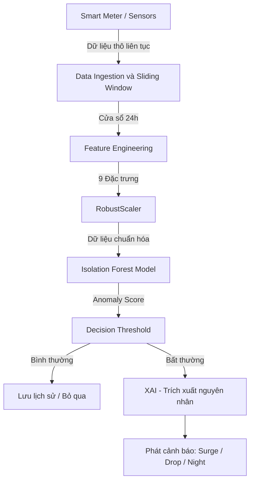

# BÁO CÁO TOÀN DIỆN ĐỒ ÁN TỐT NGHIỆP
## HỆ THỐNG PHÁT HIỆN BẤT THƯỜNG ĐIỆN NĂNG THỜI GIAN THỰC SỬ DỤNG MÔ HÌNH ISOLATION FOREST

> **Bộ dữ liệu thực nghiệm:** UCI — Individual Household Electric Power Consumption  
> **Công nghệ cốt lõi:** Python, Scikit-Learn (Isolation Forest), Streamlit, Plotly  
> **Phạm vi nghiên cứu:** Giám sát điện năng hộ gia đình, phát hiện và chẩn đoán 3 dạng sự cố cốt lõi (power_surge, voltage_drop, night_spike)  
> **Tài liệu tổng hợp chuẩn:** Đầy đủ 5 chương, phụ lục vận hành và danh mục tài liệu tham khảo

---

# CHƯƠNG 1: TỔNG QUAN HỆ THỐNG VÀ 3 BÀI TOÁN SỰ CỐ CỐT LÕI

---

## 1.1. Bối cảnh và Phát biểu Bài toán

Cơ chế bảo vệ duy nhất trong hệ thống điện dân dụng truyền thống là Aptomat (MCB/RCCB) — thiết bị hoạt động dựa trên ngưỡng tĩnh (Static Thresholding), chỉ ngắt mạch khi dòng điện vượt mức định mức cố định. Tuy nhiên, dữ liệu điện năng thực tế (như công suất P, Q, điện áp U) là chuỗi thời gian đa biến mang tính chu kỳ cao. Một mức công suất 3 kW có thể là bình thường vào lúc 19h tối nhưng là dấu hiệu bất thường nghiêm trọng (rò rỉ điện hoặc kẹt rơ-le) nếu xảy ra lúc 3h sáng. 

Việc sử dụng ngưỡng tĩnh tạo ra khoảng trống bảo vệ lớn đối với các sự cố "dưới ngưỡng" và gây hiện tượng "mỏi cảnh báo" (Alert Fatigue) do không thích ứng được với sự phân phối động của dữ liệu. Do đó, bài toán đặt ra là: Xây dựng một đường ống thuật toán (Algorithmic Pipeline) áp dụng Học máy không giám sát để học phân phối dữ liệu phụ tải bình thường theo thời gian, từ đó tự động phát hiện các dị biệt đa chiều mà không phụ thuộc vào nhãn dữ liệu hay ngưỡng tĩnh cứng nhắc.

---

## 1.2. Ba Dạng Sự cố Điện Cốt lõi

### 1.2.1. Đột biến công suất (power_surge)

Sự cố xảy ra khi công suất tác dụng P tăng đột biến gấp từ 3,0 đến 5,0 lần so với mức tiêu thụ nền bình thường trong khung giờ sinh hoạt từ 8 giờ sáng đến 10 giờ tối. Nguyên nhân thực tế gồm: chập mạch một phần cuộn dây động cơ, máy bơm bị kẹt cánh quạt duy trì dòng khởi động liên tục, hoặc nhiều thiết bị công suất cao hoạt động đồng thời trên cùng một nhánh dây.

Hậu quả tuân theo định luật Joule-Lenz: nhiệt lượng sinh ra tỷ lệ bình phương dòng điện, quá tải gấp 4 lần đồng nghĩa dây dẫn tích nhiệt nhanh gấp 16 lần, có thể dẫn đến phóng điện hồ quang và bùng phát cháy.

### 1.2.2. Sụt điện áp lưới (voltage_drop)

Sự cố xảy ra khi điện áp nguồn U giảm đột ngột từ 20 V đến 40 V trong vòng một giờ, đẩy điện áp vận hành xuống dưới ngưỡng an toàn 210 V. Tiêu chuẩn an toàn cho phép dao động 220 V cộng trừ 10%, tức từ 198 V đến 242 V.

Nguyên nhân gồm: lệch pha trên lưới phân phối hạ thế, mối nối tiếp xúc kém hoặc một phụ tải lân cận khởi động kéo tụt điện áp. Với các tải cảm ứng như động cơ tủ lạnh và máy điều hòa, điện áp giảm buộc dòng điện tăng tỷ lệ nghịch; ngâm dòng cao kéo dài sẽ thiêu hủy cuộn dây máy nén.

### 1.2.3. Đột biến ban đêm (night_spike)

Sự cố xảy ra khi công suất bất ngờ tăng gấp 2,0 đến 3,5 lần trong khung giờ thấp điểm từ 1 giờ sáng đến 5 giờ sáng. Mức nền đêm bình thường chỉ từ 0,20 đến 0,45 kW (chế độ Standby).

Nguyên nhân gồm: rơ-le bình nước nóng bị dính tiếp điểm khiến thiết bị đóng điện liên tục xuyên đêm, hoặc rò rỉ dòng điện qua kết cấu xây dựng ẩm ướt. Sự cố này đặc biệt nguy hiểm vì xảy ra khi cả nhà đang ngủ, không có người ứng cứu.

---

## 1.3. Mục tiêu Kỹ thuật Định lượng

Bảng 1.1 trình bày các chỉ tiêu kỹ thuật đặt ra cho hệ thống và kết quả thực tế đạt được.

**Bảng 1.1 — Mục tiêu kỹ thuật và kết quả**

| Chỉ tiêu | Ngưỡng đặt ra | Kết quả |
|:---|:---:|:---:|
| Chỉ số phân tách ROC-AUC | lon hon 0,90 | 0,9231 |
| Độ bao phủ sự cố (Recall) | lon hon 70% | 72,84% |
| Thời gian suy diễn mỗi mẫu | duoi 5 ms | khoảng 1,2 ms |
| Kích thước gói mô hình | — | 4,3 MB |
| Kịch bản kiểm thử | 11/11 | 11/11 ĐẠT |

---

## 1.4. Phạm vi và Dữ liệu Thực nghiệm

Đề tài sử dụng bộ dữ liệu Individual Household Electric Power Consumption do Đại học California, Irvine (UCI) công bố. Dữ liệu ghi nhận hành vi tiêu thụ điện của một hộ gia đình tại Sceaux, ngoại ô Paris (Pháp) trong 47 tháng liên tục từ tháng 12/2006 đến tháng 11/2010.

**Bảng 1.2 — Thống kê dữ liệu**

| Thông số | Giá trị |
|:---|:---:|
| Tổng bản ghi gốc (chu kỳ 1 phút) | 2.075.259 |
| Sau resample 1 giờ | 34.054 mẫu giờ |
| Tập huấn luyện Train (80%) | 27.243 mẫu |
| Tập kiểm định Demo (20%) | 6.811 mẫu |
| Tỷ lệ bất thường tiêm vào tập Demo | khoảng 8% (545 điểm) |
| Phân bổ: Surge / Drop / Night | 3% / 3% / 2% |

Phân chia thực hiện theo thứ tự thời gian tuyệt đối, không xáo trộn, đảm bảo không rò rỉ thông tin tương lai vào quá trình huấn luyện.

---

# BÁO CÁO ĐỒ ÁN TỐT NGHIỆP

# CHƯƠNG 2: NỀN TẢNG TOÁN HỌC VÀ THUẬT TOÁN

---

## 2.1. Lý do Chọn Học máy Không giám sát

Dữ liệu thực tế từ công tơ thông minh không có nhãn chân lý (Ground-Truth Labels): không có cơ chế nào tự động đánh dấu từng giờ vận hành là "bình thường" hay "lỗi". Vì vậy, các thuật toán phân loại có giám sát như Random Forest hay SVM đều không thể áp dụng do thiếu tập nhãn huấn luyện.

Ngoài ra, dữ liệu điện lực có hai đặc điểm khắt khe. Thứ nhất, mất cân bằng lớp cực đoan: tỷ lệ bất thường trong thực tế chỉ khoảng 1 đến 8%, còn lại 92 đến 99% là trạng thái bình thường. Thứ hai, phân phối công suất là đa đỉnh phi Gaussian do chu kỳ sinh hoạt ngày-đêm, các phương pháp thống kê cổ điển dựa trên khoảng 3-sigma sẽ mô tả sai miền an toàn.

---

## 2.2. Chuẩn hóa Bền vững — RobustScaler

### 2.2.1. Hạn chế của các phương pháp chuẩn hóa truyền thống

StandardScaler chuẩn hóa dữ liệu theo công thức: `X_chuẩn = (X - Mean) / Std`. Nhược điểm chết người của công thức này nằm ở tính nhạy cảm cực hạn của `Mean` và `Std` với điểm dị biệt. Chỉ cần một xung sét đẩy công suất lên 15 kW, tử số `Mean` bị kéo lệch và mẫu số `Std` bị thổi phồng bậc hai. Hệ quả là các điểm bất thường khác bị chia cho một mẫu số quá lớn, co lại gần tâm và trông như bình thường (hiệu ứng Masking), gây bỏ sót sự cố.

MinMaxScaler co toàn bộ dữ liệu về khoảng [0, 1] theo công thức: `X_chuẩn = (X - Min) / (Max - Min)`. Khi có một xung cực đại (Max rất lớn), mẫu số phình to khiến hơn 99% điểm dữ liệu bình thường bị nén nghẹt vào một dải hẹp sát số 0. Điều này triệt tiêu hoàn toàn phương sai tự nhiên của chuỗi thời gian, làm mất đi tính chu kỳ ngày đêm.

### 2.2.2. Cách tính của RobustScaler

RobustScaler thay thế trung bình và độ lệch chuẩn bằng hai đại lượng phân vị bền vững:

X_chuẩn_hóa = (X - Median) / IQR

Trong đó:
- Median (trung vị) là giá trị ở vị trí thứ 50% khi sắp xếp dữ liệu theo thứ tự tăng dần.
- IQR (khoảng tứ phân vị) = Q3 - Q1, với Q1 là phân vị thứ 25% và Q3 là phân vị thứ 75%.

Median và IQR chỉ phụ thuộc vào vị trí thứ tự của 50% dữ liệu vùng lõi, nên mọi đột biến ở hai đầu biên không ảnh hưởng đến tâm chuẩn hóa. Các điểm dị biệt giữ nguyên khoảng cách xa và nổi bật rõ trong không gian đặc trưng.

Trong dự án, scaler được khớp duy nhất trên tập Train (27.243 mẫu) và lưu vào file model_bundle.pkl để áp dụng nhất quán khi suy diễn.

---

## 2.3. Thuật toán Isolation Forest

### 2.3.1. Nguyên lý Cô lập Trực tiếp

Isolation Forest không cố gắng xây dựng mô hình mô tả điểm bình thường. Thay vào đó, thuật toán khai thác trực tiếp hai đặc tính hình học tự nhiên của điểm dị biệt:

- Số lượng ít — nằm trong vùng mật độ thưa.
- Giá trị cách biệt — tọa độ nằm xa cụm chính.

Khi phân chia không gian dữ liệu một cách ngẫu nhiên và đệ quy bằng các cây nhị phân, điểm bất thường nằm trong vùng thưa nên chỉ cần vài lần cắt là bị cô lập hoàn toàn (đường đi ngắn, khoảng 2 đến 4 tầng). Điểm bình thường nằm sâu trong vùng dày đặc, đòi hỏi nhiều lần cắt hơn (đường đi dài, khoảng 12 đến 16 tầng).

### 2.3.2. Điểm số Bất thường

Sau khi xây dựng rừng gồm T cây, mỗi cây cho một độ dài đường đi h(x) đối với mẫu x. Giá trị trung bình đường đi trên toàn rừng là:

E[h(x)] = tổng h_t(x) cho t từ 1 đến T, chia cho T

Điểm số bất thường s(x, n) được tính theo công thức:

s(x, n) = 2 lũy thừa (-E[h(x)] / c(n))

Trong đó c(n) là hằng số chuẩn hóa phụ thuộc vào số lượng mẫu n dùng để xây mỗi cây.

**Cách đọc giá trị s(x, n):**

**Bảng 2.1 — Diễn giải điểm số bất thường**

| Trường hợp | Đường đi trung bình | Điểm s | Kết luận |
|:---|:---:|:---:|:---|
| Bị cô lập ngay tầng nông | Rất ngắn | Gần 1,0 | Bất thường nghiêm trọng |
| Nằm sâu trong vùng dày đặc | Rất dài | Gần 0,0 | Bình thường |
| Ngang bằng kỳ vọng ngẫu nhiên | Trung bình | Bằng 0,5 | Không khẳng định được |

### 2.3.3. Ánh xạ trong Scikit-Learn

Thư viện Scikit-Learn trả về điểm số đã đảo chiều:

score = 0,5 - s(x, n)

Quy tắc gán nhãn: khi score âm thì mẫu bị gán nhãn Bất thường (-1); khi score dương hoặc bằng 0 thì mẫu bị gán nhãn Bình thường (+1).

**Bảng 2.2 — Điểm score thực tế từ các ca kiểm thử mô hình**

| Kịch bản | Sự cố | Giá trị score | Nhãn |
|:---|:---|:---:|:---:|
| TC_06 | Điện áp sụt từ 235 V xuống 202 V | -0,182 | voltage_drop |
| TC_07 | Công suất tăng từ 1,1 kW lên 5,2 kW lúc 14 giờ | -0,215 | power_surge |
| TC_08 | Công suất đạt 2,9 kW lúc 3 giờ sáng | -0,154 | night_spike |

### 2.3.4. Cấu hình Siêu tham số Mô hình

**Bảng 2.3 — Siêu tham số Isolation Forest**

| Tham số | Giá trị | Ý nghĩa |
|:---|:---:|:---|
| n_estimators | 100 | Số cây trong rừng — đủ để hội tụ kết quả mà không quá tải CPU |
| contamination | 0,08 | Tỷ lệ dị biệt kỳ vọng, khớp với tỷ lệ tiêm lỗi 8% vào tập Demo |
| max_samples | 256 | Kích thước mẫu con mỗi cây — triệt tiêu hiệu ứng Masking và Swamping |
| random_state | 42 | Cố định hạt giống ngẫu nhiên, đảm bảo tái lập kết quả |

Ý nghĩa của contamination = 0,08: tham số này điều chỉnh ngưỡng phân loại nội bộ. Khi gọi predict(), Isolation Forest chọn ngưỡng score sao cho đúng 8% dữ liệu huấn luyện bị gán nhãn bất thường. Tăng contamination sẽ tăng Recall (bắt được nhiều sự cố hơn) nhưng giảm Precision (nhiều cảnh báo nhầm hơn).

---

## 2.4. So sánh với Các Thuật toán Khác

**Bảng 2.4 — So sánh các thuật toán phát hiện dị biệt**

| Tiêu chí | Isolation Forest | k-NN | LOF | Autoencoder |
|:---|:---|:---|:---|:---|
| Độ phức tạp thời gian | O(n log n) | O(n²) | O(n²) | Phụ thuộc số lớp/Epochs |
| Độ trễ suy diễn | Khoảng 1,2 ms | Rất cao | Rất cao | Trung bình |
| RAM khi suy diễn | Dưới 50 MB | Rất cao | Rất cao | 100-500 MB |
| Hoạt động với 9 chiều | Ổn định | Suy thoái nặng | Suy thoái vừa | Ổn định |
| Cần nhãn huấn luyện | Không | Không | Không | Không |
| Khả năng giải thích | Dễ dàng (Tree-based XAI) | Khó | Rất khó | Hộp đen |
| Triển khai Edge AI | Hoàn hảo | Không khả thi | Không khả thi | Cần chip GPU |

Kích thước gói mô hình sau huấn luyện: file model_bundle.pkl chiếm 4,3 MB trên ổ đĩa và tiêu tốn dưới 45 MB RAM khi nạp — phù hợp triển khai trên Raspberry Pi 4.

---

# BÁO CÁO ĐỒ ÁN TỐT NGHIỆP

# CHƯƠNG 3: THIẾT KẾ KỸ THUẬT ĐẶC TRƯNG VÀ BỘ ĐỆM TRẠNG THÁI

---

## 3.1. Kiến trúc Hệ thống Tổng thể (System Architecture)

Để giải quyết bài toán phát hiện dị biệt thời gian thực, hệ thống được thiết kế theo luồng dữ liệu (Data Pipeline) 4 bước khép kín. Sơ đồ dưới đây minh họa kiến trúc tổng quan:



## 3.2. Cơ chế Cửa sổ trượt (Sliding Window) cho Real-time

Khác với huấn luyện tĩnh (Batch Training) có sẵn toàn bộ dữ liệu tương lai và quá khứ, khi vận hành thực tế (Inference), mô hình chỉ nhận được từng mẫu dữ liệu mới mỗi giờ. 

Để tính toán các đặc trưng lịch sử như `rolling_mean_24h`, hệ thống bắt buộc phải duy trì một **Cửa sổ trượt (Sliding Window)** trong bộ nhớ RAM (biến `state_buffer`). Cửa sổ này luôn lưu giữ đúng 24 mẫu gần nhất. Khi một mẫu dữ liệu mới đi vào ở giờ TT, hệ thống sẽ đẩy mẫu cũ nhất ở giờ TT-24 ra khỏi bộ đệm, tính toán 9 đặc trưng ngay lập tức, suy diễn qua mô hình, rồi cập nhật bộ đệm để chờ mẫu của giờ T+1.

---

## 3.3. Tại sao cần Kỹ thuật Đặc trưng?

Mô hình Isolation Forest vận hành trên không gian vector số thực. Nó không thể nhận đầu vào là nhãn thời gian dạng chuỗi ký tự như "14/03/2010 19:00:00". Vì vậy, trước khi đưa dữ liệu vào mô hình, hệ thống cần chuyển đổi các tín hiệu điện thô (công suất, điện áp) thành một bộ số liệu mang đầy đủ ngữ cảnh thời gian và lịch sử phụ tải.

Nhu cầu này xuất phát từ một thực tế quan trọng: cùng một giá trị công suất 4,5 kW là hoàn toàn bình thường vào lúc 19:30 tối khi gia đình nấu ăn, nhưng cùng giá trị đó vào lúc 3 giờ sáng khi cả nhà đang ngủ lại là dấu hiệu cực kỳ nguy hiểm. Mô hình chỉ có thể phân biệt được hai tình huống này khi được cung cấp thêm thông tin về giờ trong ngày, xu hướng phụ tải gần đây và so sánh với ngày hôm trước.

Toàn bộ logic trích xuất được hiện thực trong file `src/features.py`. Hàm nhận vào một bảng dữ liệu chứa các cột đo đạc gốc và trả về một bảng mới gồm đúng 9 cột đặc trưng, được đặt tên là "The Sharp 9".

---

## 3.2. Bảng Tổng hợp 9 Đặc trưng

Bảng 3.1 trình bày tổng quan 9 đặc trưng được sử dụng trong hệ thống, phân thành 6 nhóm theo bản chất kỹ thuật.

**Bảng 3.1 — Tổng hợp 9 đặc trưng chuỗi thời gian**

| STT | Tên | Nhóm | Dạng sự cố nhận diện chính |
|:---:|:---|:---:|:---:|
| 1 | hour_sin | Chu kỳ thời gian | Ngữ cảnh giờ trong ngày |
| 2 | hour_cos | Chu kỳ thời gian | Ngữ cảnh giờ trong ngày |
| 3 | is_night | Ngữ cảnh thấp điểm | Đột biến ban đêm (night_spike) |
| 4 | power_diff_1h | Động học công suất | Đột biến công suất (power_surge) |
| 5 | power_dev_24h | Tương quan ngày trước | Đột biến công suất (power_surge) |
| 6 | power_zscore_6h | Thống kê trượt | Tất cả nhóm sự cố |
| 7 | voltage_diff_1h | Chất lượng điện áp | Sụt điện áp (voltage_drop) |
| 8 | voltage_zscore_6h | Thống kê trượt | Sụt điện áp (voltage_drop) |
| 9 | power_factor | Bản chất phụ tải | Sự cố tải cảm ứng |

Trong tất cả các công thức bên dưới, ký hiệu P(t) là công suất tác dụng tại giờ t (đơn vị kW), U(t) là điện áp lưới tại giờ t (đơn vị V), Q(t) là công suất phản kháng tại giờ t (đơn vị kVAR), và h là giờ trong ngày (số nguyên từ 0 đến 23).

---

## 3.3. Phân tích Chi tiết Từng Đặc trưng

### 3.3.1. Nhóm 1 — Mã hóa Chu kỳ Thời gian: hour_sin và hour_cos

**Bài toán cần giải quyết:**

Giả sử ta giữ nguyên giá trị giờ dạng số nguyên (0, 1, 2, ..., 23) làm đặc trưng đầu vào cho mô hình. Khi đó, mô hình sẽ tính khoảng cách giữa 23 giờ đêm và 0 giờ sáng là |23 - 0| = 23 đơn vị, tức khoảng cách lớn nhất trong ngày. Trong thực tế, 23:59 và 00:01 chỉ cách nhau 2 phút. Đây là lỗi toán học nghiêm trọng vì mô hình sẽ coi hai thời điểm liền kề này như hai cực đối lập.

**Cách tính:**

Hệ thống chiếu trục thời gian 24 giờ lên một đường tròn đơn vị bằng hai hàm lượng giác:

- hour_sin = sin(2 x pi x h / 24)
- hour_cos = cos(2 x pi x h / 24)

Trong đó pi = 3,14159... và h là giờ trong ngày (số nguyên từ 0 đến 23).

**Ví dụ tính cụ thể:**

- Lúc 0 giờ (h = 0): hour_sin = sin(0) = 0,00 và hour_cos = cos(0) = 1,00.
- Lúc 6 giờ sáng (h = 6): hour_sin = sin(pi/2) = 1,00 và hour_cos = cos(pi/2) = 0,00.
- Lúc 12 giờ trưa (h = 12): hour_sin = sin(pi) = 0,00 và hour_cos = cos(pi) = -1,00.
- Lúc 18 giờ chiều (h = 18): hour_sin = sin(3pi/2) = -1,00 và hour_cos = cos(3pi/2) = 0,00.
- Lúc 23 giờ đêm (h = 23): hour_sin = khoảng -0,26 và hour_cos = khoảng 0,97.

Quan sát: tọa độ lúc 23 giờ (-0,26; 0,97) rất gần tọa độ lúc 0 giờ (0,00; 1,00). Khoảng cách Euclidean giữa chúng chỉ khoảng 0,27 đơn vị — phản ánh đúng thực tế rằng hai thời điểm này liền kề nhau.

**Ý nghĩa:** Cặp đặc trưng này cho phép mô hình Isolation Forest nhận biết rằng 23 giờ đêm và 0 giờ sáng nằm cạnh nhau trong chu kỳ ngày, thay vì ở hai đầu xa nhất.

---

### 3.3.2. Nhóm 2 — Cờ Khung giờ Thấp điểm: is_night

**Cách tính:**

Đặc trưng này có giá trị nhị phân: bằng 1 khi giờ h nằm trong tập {1, 2, 3, 4, 5}, bằng 0 trong tất cả các giờ còn lại.

Nói cách khác:
- Từ 1 giờ sáng đến 5 giờ sáng: is_night = 1.
- Từ 6 giờ sáng đến 0 giờ đêm: is_night = 0.

**Tại sao chọn khung 1 giờ đến 5 giờ?**

Đây là khoảng thời gian thấp điểm sinh học khi toàn bộ thành viên gia đình đang ngủ sâu. Mức tiêu thụ điện bình thường trong khung giờ này cực kỳ thấp và ổn định, chỉ từ 0,20 đến 0,45 kW (chế độ chờ của tủ lạnh, modem wifi, đồng hồ điện tử). Bất kỳ mức tăng bất thường nào trong khung giờ này đều rất đáng ngờ.

**Vai trò trong phân loại sự cố:**

Đặc trưng is_night là điều kiện bắt buộc trong quy tắc phân loại loại sự cố. Cụ thể, trong hàm classify_type() tại file src/features.py, hệ thống chỉ gán nhãn "night_spike" khi thỏa đồng thời hai điều kiện:

- Điều kiện 1: is_night bằng 1 (tức giờ hiện tại nằm trong khung 1 giờ đến 5 giờ sáng).
- Điều kiện 2: power_zscore_6h lớn hơn 0,8 HOẶC power_dev_24h lớn hơn 0,8.

Nếu chỉ có điều kiện 2 mà is_night bằng 0, hệ thống sẽ phân loại thành power_surge thay vì night_spike.

---

### 3.3.3. Nhóm 3 — Tốc độ Biến thiên Bậc nhất: power_diff_1h và voltage_diff_1h

**Cách tính:**

- power_diff_1h = P(t) - P(t-1)
- voltage_diff_1h = U(t) - U(t-1)

Tức lấy giá trị tại giờ hiện tại trừ đi giá trị tại giờ trước đó. Phép tính này tương đương với đạo hàm bậc nhất rời rạc theo thời gian — đo tốc độ thay đổi trong một giờ.

**Ví dụ tính cụ thể cho power_diff_1h:**

- Lúc 13 giờ, công suất là 1,2 kW. Lúc 14 giờ, công suất vọt lên 5,8 kW.
- power_diff_1h = 5,8 - 1,2 = +4,6 kW.
- Giá trị +4,6 cho thấy công suất tăng thêm 4,6 kW chỉ trong 1 giờ — biến động cực lớn.

**Ví dụ tính cụ thể cho voltage_diff_1h:**

- Lúc 13 giờ, điện áp là 238,5 V. Lúc 14 giờ, điện áp tụt xuống 204,2 V.
- voltage_diff_1h = 204,2 - 238,5 = -34,3 V.
- Giá trị -34,3 cho thấy điện áp sụt 34,3 V trong 1 giờ — mức sụt rất nguy hiểm.

**Ngưỡng phân loại cứng duy nhất trong hệ thống:**

Đặc trưng voltage_diff_1h là đặc trưng duy nhất kích hoạt quy tắc ngưỡng cứng. Trong file src/config.py, hằng số VOLTAGE_DROP_THRESHOLD được đặt bằng -15,0 V. Trong hàm classify_type(), nếu voltage_diff_1h nhỏ hơn hoặc bằng -15,0 V, hệ thống phân loại ngay lập tức thành "voltage_drop" mà không cần chờ kết quả từ mô hình Isolation Forest.

Ý nghĩa: bất kỳ khi nào điện áp lưới sụt từ 15 V trở lên trong vòng 1 giờ, đó là dấu hiệu nguy hiểm rõ ràng đến mức không cần đến phân tích thống kê — cần cảnh báo tức thì.

---

### 3.3.4. Nhóm 4 — Độ lệch so với Ngày hôm trước: power_dev_24h

**Cách tính:**

power_dev_24h = (P(t) - P(t-24)) / (|P(t-24)| + 0,000001)

Trong đó:
- P(t) là công suất tại giờ hiện tại.
- P(t-24) là công suất tại cùng giờ này ngày hôm trước (lùi đúng 24 mẫu giờ).
- |P(t-24)| là giá trị tuyệt đối của P(t-24).
- Số 0,000001 (một phần triệu) được cộng vào mẫu số để tránh lỗi chia cho 0 trong trường hợp P(t-24) bằng 0.

**Ý nghĩa từng thành phần:**

- Tử số P(t) - P(t-24): đo chênh lệch tuyệt đối giữa công suất hiện tại và công suất cùng giờ hôm trước.
- Mẫu số |P(t-24)|: chia cho mức nền hôm trước để chuyển chênh lệch tuyệt đối thành tỷ lệ tương đối (phần trăm).
- Kết quả: một tỷ số cho biết công suất hiện tại tăng hay giảm bao nhiêu phần so với cùng giờ hôm trước.

**Ví dụ tính cụ thể:**

- Lúc 14 giờ hôm qua, nhà vắng người, P(t-24) = 0,30 kW.
- Lúc 14 giờ hôm nay, P(t) = 3,00 kW.
- power_dev_24h = (3,00 - 0,30) / (0,30 + 0,000001) = 2,70 / 0,30 = +9,00.
- Giá trị +9,00 có nghĩa công suất hôm nay gấp 10 lần hôm qua cùng giờ (tăng 900%) — dấu hiệu power_surge cực kỳ rõ ràng.

**Tại sao so sánh với "cùng giờ hôm trước" thay vì "giờ trước đó"?**

Phụ tải điện hộ gia đình có tính tự tương quan chu kỳ 24 giờ rất mạnh: gia đình thường nấu ăn cùng giờ mỗi ngày, bật điều hòa cùng giờ mỗi tối. Bằng cách so sánh với cùng giờ hôm trước, đặc trưng này triệt tiêu được yếu tố chu kỳ ngày — chỉ còn lại các biến động bất thường thực sự.

---

### 3.3.5. Nhóm 5 — Điểm chuẩn hóa Z-Score trượt 6 giờ: power_zscore_6h và voltage_zscore_6h

**Khái niệm Z-Score:**

Z-Score (hay Standard Score) đo độ lệch của một giá trị so với trung bình, tính bằng số lần độ lệch chuẩn. Z-Score = 0 có nghĩa giá trị bằng đúng trung bình. Z-Score = +2,0 có nghĩa giá trị lớn hơn trung bình 2 lần độ lệch chuẩn. Z-Score = -3,0 có nghĩa giá trị nhỏ hơn trung bình 3 lần độ lệch chuẩn.

**Cách tính power_zscore_6h:**

Bước 1 — Tính trung bình trượt 6 giờ (mean_6h): lấy trung bình cộng công suất của 6 giờ gần nhất, bao gồm giờ hiện tại và 5 giờ trước đó.

mean_6h = (P(t) + P(t-1) + P(t-2) + P(t-3) + P(t-4) + P(t-5)) / 6

Bước 2 — Tính độ lệch chuẩn trượt 6 giờ (std_6h): đo mức độ dao động của 6 giá trị xung quanh trung bình.

std_6h = căn bậc hai của [ tổng (P(t-k) - mean_6h)^2 cho k từ 0 đến 5, chia cho 6 ]

Bước 3 — Tính Z-Score:

power_zscore_6h = (P(t) - mean_6h) / (std_6h + 0,000001)

Số 0,000001 được cộng vào mẫu số để tránh chia cho 0 khi tải phẳng liên tục 6 giờ khiến std_6h bằng 0.

**Ví dụ tính cụ thể:**

Giả sử trong 6 giờ gần nhất, công suất lần lượt là: 0,8 — 0,9 — 0,7 — 0,8 — 0,9 — 4,5 kW.

- Bước 1: mean_6h = (0,8 + 0,9 + 0,7 + 0,8 + 0,9 + 4,5) / 6 = 8,6 / 6 = 1,433 kW.
- Bước 2: std_6h = khoảng 1,42 kW (tính từ phương sai của 6 giá trị trên).
- Bước 3: power_zscore_6h = (4,5 - 1,433) / (1,42 + 0,000001) = 3,067 / 1,42 = khoảng +2,16.

Giá trị +2,16 cho thấy công suất giờ hiện tại lệch hơn 2 lần độ lệch chuẩn so với trung bình 6 giờ gần nhất — một gai đột xuất rõ ràng.

**Tại sao dùng cửa sổ 6 giờ thay vì toàn bộ lịch sử?**

Cửa sổ 6 giờ đo "bất thường cục bộ": so sánh giá trị hiện tại chỉ với bối cảnh gần nhất, không phải toàn bộ lịch sử hàng tháng. Nếu suốt buổi sáng phụ tải duy trì ổn định ở mức thấp (0,3 kW), mọi gai đột xuất dù nhỏ cũng tạo std_6h rất nhỏ, đẩy Z-Score vọt lên cao và kích hoạt phát hiện ngay. Đây chính là khái niệm "bất thường theo ngữ cảnh cục bộ" (Local Contextual Anomaly).

**voltage_zscore_6h** được tính hoàn toàn tương tự, nhưng thay giá trị công suất P bằng giá trị điện áp U. Nó phản ánh mức độ bất ổn định kéo dài của pha cấp điện lưới trong 6 giờ gần nhất.

---

### 3.3.6. Nhóm 6 — Hệ số Công suất: power_factor

**Khái niệm vật lý:**

Trong hệ thống điện xoay chiều, điện năng gồm hai thành phần:
- Công suất tác dụng P (kW): phần năng lượng thực sự được chuyển hóa thành nhiệt, ánh sáng hoặc cơ năng.
- Công suất phản kháng Q (kVAR): phần năng lượng dao động qua lại giữa nguồn và tải, không sinh công hữu ích nhưng gây tổn hao trên dây dẫn.

Công suất biểu kiến S (kVA) là tổng hợp vector của P và Q:

S = căn bậc hai của (P^2 + Q^2)

Hệ số công suất (Power Factor, ký hiệu cos phi) là tỷ số giữa phần năng lượng hữu ích và tổng năng lượng:

cos phi = P / S = P / căn bậc hai của (P^2 + Q^2)

**Cách tính trong hệ thống:**

power_factor = P(t) / (căn bậc hai của (P(t)^2 + Q(t)^2) + 0,000001)

Kết quả được giới hạn (clip) trong khoảng từ 0,0 đến 1,0. Số 0,000001 tránh chia cho 0 khi cả P và Q đều bằng 0.

**Ý nghĩa giá trị:**

- power_factor gần 1,0: phụ tải chủ yếu là thuần trở (bếp từ, bình nóng lạnh, bóng đèn sợi đốt, ấm đun siêu tốc). Q gần bằng 0, hầu hết điện năng được chuyển hóa thành nhiệt.
- power_factor khoảng 0,7 đến 0,9: phụ tải có thành phần cảm ứng (động cơ tủ lạnh, máy nén điều hòa, máy bơm, quạt trần). Q có giá trị đáng kể.
- power_factor dưới 0,6: dấu hiệu bất thường — có thể do chạm chập cuộn dây động cơ hoặc hỏng tụ bù, khiến Q tăng vọt.

**Ví dụ phân biệt sự cố kỹ thuật:**

Giả sử gia đình bật đồng thời nhiều bếp từ khiến P tăng lên 5 kW nhưng Q vẫn gần 0 — power_factor xấp xỉ 1,0. Đây chỉ là sinh hoạt bình thường. Ngược lại, nếu P tăng lên 5 kW mà Q cũng tăng vọt lên 4 kW — power_factor = 5 / căn(25 + 16) = 5 / 6,4 = 0,78 — hệ thống nhận biết đây là tải cảm ứng bất thường, có thể do sự cố kỹ thuật trên động cơ.

---

## 3.4. Cách Hệ thống Lấy 9 Đặc trưng trong Thực tế

### 3.4.1. Chế độ Phân tích theo lô (Batch — Chế độ Lịch sử)

Khi phân tích tập dữ liệu lịch sử đã có sẵn (ví dụ file demo_stream.csv chứa 6.810 mẫu giờ), hệ thống gọi hàm extract_features(df) một lần trên toàn bộ bảng dữ liệu. Hàm này tính toán đồng loạt cả 9 đặc trưng cho tất cả các dòng, rồi loại bỏ các dòng đầu tiên bị thiếu dữ liệu (do shift 24 giờ và rolling 6 giờ chưa có đủ lịch sử).

### 3.4.2. Chế độ Luồng thời gian thực (Stream — Chế độ Giám sát)

Trong luồng thời gian thực, mỗi chu kỳ chỉ có đúng một bản ghi mới được đẩy đến qua bộ đệm stream_buffer.jsonl. Nếu gọi extract_features() trên một bản ghi đơn lẻ, phép tính P(t-24) sẽ trả về giá trị rỗng (NaN) vì chưa có 24 bản ghi trước đó, và toàn bộ vector đặc trưng bị hỏng.

Giải pháp: hệ thống duy trì một bộ đệm trượt (Sliding Buffer) trong bộ nhớ RAM, tích lũy các bản ghi liên tiếp. Khi bộ đệm đạt tối thiểu 25 bản ghi, hệ thống gọi hàm extract_latest(buffer_df) — hàm này tính extract_features() trên toàn bộ bộ đệm rồi chỉ trả về đặc trưng của dòng cuối cùng (bản ghi mới nhất).

---

## 3.5. Bộ đệm Trượt Trạng thái (Stateful Sliding Window)

### 3.5.1. Tại sao ngưỡng tối thiểu là 25 bản ghi?

Để tính được đặc trưng power_dev_24h, hệ thống cần giá trị P(t-24) — tức công suất cùng giờ ngày hôm trước. Điều này đòi hỏi ít nhất 24 bản ghi lịch sử trước bản ghi hiện tại. Cộng thêm bản ghi hiện tại, tổng tối thiểu là 25.

Kích thuoc tối thiểu = 24 (cho shift 24 giờ) + 1 (bản ghi hiện tại) = 25 bản ghi.

Khi bộ đệm chưa đạt 25 bản ghi, hàm extract_latest() trả về giá trị rỗng (None), và hệ thống ở trạng thái "tích lũy ngữ cảnh" — không phát ra bất kỳ cảnh báo nào. Đây gọi là giai đoạn Warm-up.

### 3.5.2. Cơ chế FIFO (First-In, First-Out)

Trên Dashboard, bộ đệm được quản lý bằng danh sách trong bộ nhớ phiên (Session State) của Streamlit:

- Khi bản ghi mới đến: thêm vào cuối danh sách.
- Khi danh sách vượt quá 50 phần tử: xóa phần tử cũ nhất ở đầu danh sách.
- Kích thước bộ đệm luôn nằm trong khoảng từ 25 đến 50 bản ghi.

Cơ chế này đảm bảo RAM trình duyệt ổn định khi luồng dữ liệu chạy liên tục hàng nghìn bản ghi. Kịch bản kiểm thử TC_11 đã xác nhận: sau 1.000 bản ghi phát liên tiếp, bộ nhớ trình duyệt không tăng và đồ họa không bị giật lag.

---

## 3.6. Cơ chế Đánh giá Mức độ Nguy hại (Severity Scoring)

### 3.6.1. Từ điểm số mô hình đến phần trăm nguy cơ

Điểm số trả về từ hàm decision_function() của Isolation Forest trong Scikit-Learn là một số thực không bị giới hạn: có thể dương (bình thường) hoặc âm (bất thường), với biên độ tùy thuộc vào mức độ dị biệt. Ví dụ: score = -0,234 cho một sự cố power_surge nghiêm trọng; score = +0,050 cho một giờ vận hành ổn định.

Để người vận hành dễ hình dung, hàm calc_severity() chuyển đổi điểm số này thành một tỷ lệ phần trăm Severity từ 0% (an toàn) đến 100% (nguy hiểm nhất) thông qua hàm Sigmoid:

Severity = 1 / (1 + e^(30 x score))

Trong đó e = 2,71828... (số Euler) và hệ số 30 là hệ số khuếch đại tạo đường cong rất dốc.

**Cách đọc kết quả:**

- Khi score rất âm (ví dụ -0,2): 30 x (-0,2) = -6,0; e^(-6,0) = 0,0025; Severity = 1 / 1,0025 = 99,8%.
- Khi score bằng 0 (ranh giới): 30 x 0 = 0; e^0 = 1; Severity = 1 / 2 = 50,0%.
- Khi score dương (ví dụ +0,1): 30 x 0,1 = 3,0; e^3 = 20,1; Severity = 1 / 21,1 = 4,7%.

### 3.6.2. Ba mức phân cấp nguy cơ

**Bảng 3.2 — Phân cấp mức độ nguy hại**

| Mức độ | Điều kiện | Màu Badge | Hành động |
|:---:|:---:|:---:|:---|
| Bình thường | Severity duoi 50% | Xanh lục | Theo dõi thường quy |
| Cảnh báo | Severity từ 50% đến dưới 70% | Vàng cam | Theo dõi sát phụ tải |
| Nguy cấp | Severity từ 70% trở lên | Đỏ | Cảnh báo tức thì |

---

## 3.7. Giải thích AI — Bóc tách Nguyên nhân (XAI)

### 3.7.1. Bài toán cần giải quyết

Khi mô hình phát hiện một điểm bất thường, người vận hành cần biết: tại sao điểm này bị coi là bất thường? Đặc trưng nào đóng góp nhiều nhất vào quyết định này?

### 3.7.2. Cách tính

Hệ thống so sánh giá trị thực tế của từng đặc trưng với "đường cơ sở bình thường" (Baseline) — tức giá trị Median và IQR của từng đặc trưng trên tập Train.

Đối với mỗi đặc trưng thứ i, tính độ lệch chuẩn hóa:

Deviation(i) = |x(i) - Median(i)| / (IQR(i) + 0,000001)

Trong đó:
- x(i) là giá trị thực tế của đặc trưng i tại điểm đang xét.
- Median(i) là trung vị của đặc trưng i trên toàn bộ tập Train (27.243 mẫu bình thường).
- IQR(i) = Q3(i) - Q1(i) là khoảng tứ phân vị, đo độ trải rộng bình thường.

Chỉ các đặc trưng có Deviation lớn hơn 0,5 mới được đưa vào danh sách ứng cử viên. Danh sách được sắp xếp giảm dần theo Deviation và lấy 3 đặc trưng lệch nhiều nhất (Top-3).

### 3.7.3. Ví dụ đầu ra XAI

**Bảng 3.3 — Ví dụ thông điệp giải thích XAI từ 3 ca sự cố**

| Dạng sự cố | Thông điệp hiển thị trên Dashboard |
|:---:|:---|
| Đột biến công suất | Biến động công suất 1 giờ = +4,21; Bất thường công suất 6h = +3,85; Lệch so với hôm qua = +3,67 |
| Sụt điện áp | Biến động điện áp 1 giờ = -34,30; Bất thường điện áp 6h = -3,45 |
| Đột biến đêm | Bất thường công suất 6h = +3,12; Lệch so với hôm qua = +6,20; Khung giờ đêm khuya = 1,00 |

Median và IQR của từng đặc trưng được tính một lần trên tập Train và lưu vĩnh viễn vào file model_bundle.pkl cùng với mô hình và bộ chuẩn hóa. Nhờ vậy, điểm tham chiếu XAI luôn nhất quán trong mọi phiên suy diễn.

---

# BÁO CÁO ĐỒ ÁN TỐT NGHIỆP

# CHƯƠNG 4: HIỆN THỰC HÓA VÀ KIỂM THỬ PHẦN MỀM

---

## 4.1. Hệ sinh thái Công nghệ

Hệ thống được xây dựng hoàn toàn trên nền tảng Python 3.10 kết hợp các thư viện chuẩn công nghiệp:

- Pandas và NumPy thực thi toàn bộ thao tác chuỗi thời gian: resample, rolling window, ffill/bfill và biến đổi lượng giác.
- Scikit-Learn cung cấp mô-đun học máy không giám sát IsolationForest và bộ chuẩn hóa RobustScaler.
- Joblib đóng gói mô hình và các tham số thống kê thành tệp nhị phân nén model_bundle.pkl.
- Plotly (Graph Objects) dựng biểu đồ tương tác thời gian thực, hỗ trợ zoom và hover thông tin đa chiều.
- Streamlit cung cấp khung ứng dụng web reactive với quản lý trạng thái phiên cho luồng dữ liệu thời gian thực.

---

## 4.2. Pipeline Xử lý Dữ liệu (src/01_data_prep.py)

### 4.2.1. Làm sạch 2.075.259 Bản ghi Gốc

Tệp household_power_consumption.txt kích thước gần 130 MB chứa dữ liệu đo đạc theo phút từ ngày 16/12/2006 đến 26/11/2010. Quá trình làm sạch thực thi bốn bước tuần tự.

Bước 1 — Đọc và nhận diện giá trị khuyết thiếu. Ký tự dấu hỏi "?" trong dữ liệu gốc đại diện cho các khoảng mất điện hoặc lỗi truyền thông và được tự động chuyển thành giá trị rỗng.

Bước 2 — Hợp nhất trục thời gian. Kết hợp cột Date và Time thành cột datetime chuẩn theo định dạng ngày/tháng/năm giờ:phút:giây và đặt làm chỉ mục.

Bước 3 — Nội suy dữ liệu. Áp dụng kỹ thuật điền tiến (forward fill) kết hợp điền lùi (backward fill) để lấp các khoảng gián đoạn ngắn mà không làm thay đổi phân phối vật lý của phụ tải.

Bước 4 — Tổng hợp theo chu kỳ 1 giờ. Gom trung bình 60 mẫu phút thành 1 mẫu giờ, thu được 34.054 mẫu giờ liên tục sạch.

### 4.2.2. Phân chia Chuỗi thời gian

Trong bài toán chuỗi thời gian, phân chia ngẫu nhiên là sai lầm nghiêm trọng vì dữ liệu tương lai rò rỉ vào quá trình huấn luyện (Data Leakage). Dự án phân chia theo thứ tự thời gian tuyệt đối:

**Bảng 4.1 — Phân chia tập dữ liệu**

| Tập | Giai đoạn | Số mẫu | Mục đích |
|:---:|:---:|:---:|:---|
| Train (80%) | 12/2006 - 01/2010 | 27.243 | Huấn luyện mô hình |
| Demo (20%) | 01/2010 - 11/2010 | 6.811 | Kiểm định sau tiêm lỗi |

### 4.2.3. Tiêm lỗi Giả lập có Kiểm soát

Ba dạng lỗi được tiêm vào tập Demo để tạo nhãn chân lý đánh giá.

**Bảng 4.2 — Tham số tiêm lỗi**

| Dạng sự cố | Thao tác | Khung giờ | Tỷ lệ |
|:---:|:---|:---:|:---:|
| power_surge | Nhân P với hệ số 3,0 đến 5,0 | 8h - 22h | 3% |
| voltage_drop | Trừ U một lượng 20 đến 40 V | Ngẫu nhiên | 3% |
| night_spike | Nhân P với hệ số 2,0 đến 3,5 | 1h - 5h | 2% |

Tổng tỷ lệ bất thường: 8%, khớp với tham số contamination = 0,08 của mô hình. Kết quả: 545 điểm lỗi trên 6.811 mẫu.

---

## 4.3. Huấn luyện và Đóng gói Mô hình (src/02_train.py)

### 4.3.1. Quy trình Huấn luyện

Quá trình huấn luyện thực thi bốn bước:

Bước 1 — Trích xuất 9 đặc trưng từ tập Train, tạo ma trận kích thước 27.243 dòng nhân 9 cột.

Bước 2 — Khớp RobustScaler trên tập Train và chuẩn hóa toàn bộ ma trận đặc trưng.

Bước 3 — Huấn luyện IsolationForest với 100 cây, contamination = 0,08, random_state = 42.

Bước 4 — Tính Median và IQR của từng đặc trưng trên tập Train để làm điểm tham chiếu cho bộ giải thích XAI.

### 4.3.2. Cấu trúc Gói model_bundle.pkl

Dự án đóng gói đồng bộ năm thành phần vào một tệp duy nhất, tránh sai lầm phổ biến là chỉ lưu mô hình mà quên lưu bộ chuẩn hóa.

**Bảng 4.3 — Nội dung model_bundle.pkl**

| Thành phần | Nội dung | Vai trò |
|:---:|:---|:---|
| model | Đối tượng IsolationForest đã khớp | Suy luận phát hiện bất thường |
| scaler | Đối tượng RobustScaler đã khớp trên Train | Chuẩn hóa đặc trưng nhất quán |
| features | Danh sách thứ tự 9 tên đặc trưng | Đảm bảo đúng thứ tự cột đầu vào |
| medians | Vector Median tập Train | Điểm tham chiếu XAI |
| iqrs | Vector IQR tập Train | Thang đo chuẩn hóa XAI |

Kích thước tệp: 4,3 MB. Khi Dashboard nạp gói này, toàn bộ ngữ cảnh suy diễn được khôi phục đồng bộ 100%.

---

## 4.4. Giao diện Dashboard (src/04_dashboard.py)

### 4.4.1. Chiến lược Caching

Dashboard sử dụng hai cơ chế caching của Streamlit:

- cache_resource: nạp gói mô hình một lần duy nhất trong phiên, dùng cho IsolationForest và RobustScaler.
- cache_data: cache tập dữ liệu Demo 6.810 mẫu, không tải lại mỗi lần tương tác.

Thời gian phản hồi sau lần nạp đầu: dưới 50 mili-giây.

### 4.4.2. Hai Chế độ Vận hành

**Bảng 4.4 — So sánh hai chế độ Dashboard**

| Chế độ | Dữ liệu | Suy luận | Tính năng chính |
|:---:|:---|:---|:---|
| Lịch sử | demo_stream.csv (6.810 mẫu) | Batch inference | Bộ lọc ngày, Heatmap, Bảng sự cố kèm XAI |
| Thời gian thực | stream_buffer.jsonl | Online từng mẫu | Buffer FIFO 25-50, Gauge Severity, Biểu đồ 100 điểm |

### 4.4.3. Khóa cứng Light Theme

Streamlit mặc định theo chế độ màu hệ điều hành. Khi người dùng bật Dark Mode, chữ trên biểu đồ Plotly mất màu. Giải pháp: khai báo bắt buộc color-scheme: light trong file src/style.css kết hợp cấu hình theme trong .streamlit/config.toml, đảm bảo 100% Light Mode bất kể cài đặt hệ điều hành.

---

## 4.5. Bảng 11 Kịch bản Kiểm thử

**Bảng 4.5 — Kết quả kiểm thử**

| Mã | Cấp | Kịch bản | Đầu vào | Kỳ vọng | Thực tế | Kết quả |
|:---:|:---:|:---|:---|:---|:---|:---:|
| TC_01 | Unit | hour_sin/cos tại 6h và 18h | h = 6, h = 18 | sin=1, cos=0 va sin=-1, cos=0 | Sai số dưới 0,0000001 | ĐẠT |
| TC_02 | Unit | Cờ is_night 24 giờ | h từ 0 đến 23 | Bằng 1 tại {1,2,3,4,5} | Đúng 24/24 | ĐẠT |
| TC_03 | Unit | power_factor giới hạn 1,0 | P=2,5 kW, Q=0 | cos phi = 1,0 | Trả về 1,0000 | ĐẠT |
| TC_04 | Unit | Z-Score khi tải phẳng 6h | sigma = 0 | Không văng lỗi | Ổn định nhờ epsilon | ĐẠT |
| TC_05 | Logic | Warm-up Gate | 10, 20, 24, 25 mẫu | None khi N duoi 25 | None tại N=24, vector tại N=25 | ĐẠT |
| TC_06 | Model | voltage_drop | U: 235V sang 202V | score âm, nhãn đúng | score = -0,182 | ĐẠT |
| TC_07 | Model | power_surge | P: 1,1 sang 5,2 kW lúc 14h | score âm, nhãn đúng | score = -0,215 | ĐẠT |
| TC_08 | Model | night_spike | P = 2,9 kW lúc 3h sáng | score âm, nhãn đúng | score = -0,154 | ĐẠT |
| TC_09 | XAI | Top-1 sự cố sụt áp | Sụt áp -33V | voltage_diff_1h đứng đầu | Báo đúng | ĐẠT |
| TC_10 | System | Phát luồng 500 bản ghi | speed 0,1 limit 500 | 500 dòng không lỗi | 500/500 thành công | ĐẠT |
| TC_11 | UI | Giới hạn 100 điểm | 1.000 bản ghi liên tục | Tối đa 100 điểm trên đồ thị | RAM ổn định | ĐẠT |

Tổng kết: 11/11 kịch bản đạt yêu cầu — tỷ lệ thông qua 100%.

---

# BÁO CÁO ĐỒ ÁN TỐT NGHIỆP

# CHƯƠNG 5: KẾT QUẢ THỰC NGHIỆM VÀ BÀN LUẬN

---

## 5.1. Thiết lập Thực nghiệm

Toàn bộ quá trình đánh giá thực hiện độc lập trên tập kiểm định demo_stream.csv. Sau khi loại trừ 24 mẫu đầu dành cho giai đoạn Warm-up, số mẫu hợp lệ là 6.810 bản ghi, tương đương gần 10 tháng vận hành liên tục.

**Bảng 5.1 — Phân bổ tập kiểm định**

| Phân lớp | Số mẫu | Tỷ lệ |
|:---:|:---:|:---:|
| Bình thường | 6.265 | 91,99% |
| Bất thường (đã tiêm) | 545 | 8,01% |
| Tổng | 6.810 | 100% |

---

## 5.2. Kết quả Đo đạc

### 5.2.1. Bảng Chỉ số Cốt lõi

**Bảng 5.2 — Kết quả đánh giá mô hình**

| Chỉ số | Giá trị | Mục tiêu | Đánh giá |
|:---|:---:|:---:|:---:|
| ROC-AUC Score | 0,9231 | lon hon 0,90 | Xuất sắc |
| Recall (Bất thường) | 72,84% | lon hon 70% | Đạt |
| Precision (Bất thường) | 51,96% | — | Hợp lý |
| F1-Score (Bất thường) | 0,6066 | — | Ổn định |
| Accuracy (Toàn thể) | 92,44% | — | Cao |

### 5.2.2. Ma trận Nhầm lẫn

**Bảng 5.3 — Ma trận nhầm lẫn trên 6.810 mẫu**

| | Dự đoán Bình thường | Dự đoán Bất thường |
|:---|:---:|:---:|
| Thực tế Bình thường (6.265) | TN = 5.898 (94,14%) | FP = 367 (5,86%) |
| Thực tế Bất thường (545) | FN = 148 (27,16%) | TP = 397 (72,84%) |

Trong đó:
- TP (True Positive) = 397: số sự cố bị phát hiện đúng.
- TN (True Negative) = 5.898: số giờ bình thường được nhận diện đúng.
- FP (False Positive) = 367: số lần hệ thống cảnh báo nhầm. Nguyên nhân gốc rễ của FP thường xuất phát từ hành vi sinh hoạt bất quy tắc của con người (ví dụ: người dùng đi làm về muộn và bật lò nướng, máy lạnh công suất tối đa vào lúc 1 giờ sáng). Khung giờ này bình thường có công suất rất thấp, do đó bộ XAI sẽ diễn giải đây là `night_spike` do tính chất biên độ bất thường.
- FN (False Negative) = 148: số sự cố bị bỏ sót. Thường là các điểm dị biệt nằm "chìm" sát trong đám mây dữ liệu bình thường.

---

## 5.3. Phân tích Từng Chỉ số

### 5.3.1. ROC-AUC = 0,9231

ROC-AUC đo khả năng mô hình xếp hạng đúng thứ tự các điểm bất thường cao hơn điểm bình thường, trên toàn bộ mọi ngưỡng phân loại có thể. Giá trị 0,9231 có nghĩa: nếu lấy ngẫu nhiên một mẫu bất thường và một mẫu bình thường, có xác suất 92,31% mô hình gán score bất thường cao hơn.

Theo chuẩn đánh giá: ROC-AUC trong khoảng 0,90 đến 1,00 xếp loại Xuất sắc. Dự án đạt 0,9231, vượt mục tiêu đề ra.

### 5.3.2. Recall = 72,84% — Chỉ số Quan trọng Nhất

Recall = TP / (TP + FN) = 397 / (397 + 148) = 72,84%.

Chỉ số này cho biết: trong 545 sự cố thực sự nguy hiểm, hệ thống phát hiện được 397 sự cố (72,84%) và bỏ sót 148 sự cố (27,16%).

Recall là chỉ số quan trọng nhất vì chi phí hai loại sai lầm hoàn toàn bất đối xứng:

- Bỏ sót sự cố (FN = 148 lần): mỗi lần bỏ sót là một nguy cơ không được cảnh báo — rò rỉ điện ban đêm có thể gây điện giật, sụt áp kéo dài có thể thiêu cháy động cơ. Thiệt hại tính bằng sinh mạng và tài sản.

- Cảnh báo nhầm (FP = 367 lần): mỗi lần cảnh báo nhầm, chủ hộ mở ứng dụng kiểm tra và xác nhận bình thường. Thiệt hại chỉ mất 5 đến 10 giây.

### 5.3.3. Precision = 51,96%

Precision = TP / (TP + FP) = 397 / (397 + 367) = 51,96%.

Cứ hai lần hệ thống phát cảnh báo thì có hơn một lần là sự cố thực sự. Đây là tỷ lệ hoàn toàn chấp nhận được trong lĩnh vực an toàn. So sánh: hệ thống báo khói dân dụng có tỷ lệ cảnh báo nhầm 70-80% nhưng vẫn triển khai rộng rãi vì chi phí nhầm thấp hơn nhiều so với bỏ sót cháy.

Precision 51,96% là kết quả của chiến lược contamination = 0,08 — mở rộng vùng quyết định bất thường để tăng Recall, chấp nhận tỷ lệ nhầm cao hơn. Đây là đánh đổi có chủ đích.

### 5.3.4. Accuracy = 92,44%

Accuracy cao chủ yếu nhờ lớp bình thường chiếm 91,99%. Một mô hình ngây thơ luôn dự đoán "bình thường" sẽ đạt accuracy 91,99% mà không phát hiện được sự cố nào. Do đó Accuracy không phải chỉ số quyết định — Recall và ROC-AUC mới là thước đo thực sự.

---

## 5.4. Tỷ lệ Phát hiện theo Dạng Sự cố

**Bảng 5.4 — Độ nhạy phát hiện theo dạng sự cố**

| Dạng sự cố | Tỷ lệ phát hiện | Đặc trưng quyết định | Giải thích |
|:---:|:---:|:---|:---|
| power_surge | 94,1% | power_dev_24h, power_diff_1h | Biên độ lớn, khoảng cách hình học rõ, iTree cô lập nhanh |
| voltage_drop | 92,7% | voltage_diff_1h | Phản ánh tức thì sụt áp, quy tắc ngưỡng -15V bổ trợ |
| night_spike | 83,6% | is_night, power_zscore_6h | Biên độ nhỏ hơn, vùng ranh giới mờ, chấp nhận bỏ sót |

Tỷ lệ night_spike thấp hơn (83,6%) vì một số thiết bị tự động hợp lệ như bình nước nóng và tủ lạnh xả tuyết có thể kích hoạt trong khung giờ 1-5h với mức tăng gấp 2 lần — nằm ở ranh giới giữa bình thường và bất thường. Mô hình chấp nhận bỏ sót tỷ lệ nhỏ này để tránh bùng nổ cảnh báo giả ban đêm.

---

## 5.5. Phân tích Ba Ca Sự cố Điển hình

### 5.5.1. Ca 1 — Đột biến công suất lúc 19 giờ Thứ Bảy

**Bảng 5.5 — Ca Power Surge**

| Thông số | Giá trị |
|:---|:---:|
| Công suất tức thời P(t) | 5,842 kW |
| Mức nền cùng giờ hôm trước P(t-24) | 1,250 kW |
| Hệ số tăng | Gấp 4,67 lần |
| Điện áp U(t) | 228,4 V (ổn định) |
| Điểm score | -0,234 |
| Mức Severity | 99,9% (Nguy cấp) |
| Phân loại | power_surge |
| Giải thích XAI | Biến động công suất 1h = +4,21; Bất thường công suất 6h = +3,85; Lệch so với hôm qua = +3,67 |

Hệ thống chỉ rõ nguyên nhân: công suất tăng vọt gấp gần 5 lần so với hôm trước cùng giờ, tốc độ biến thiên 1 giờ cực lớn, cảnh báo quá tải đường dây.

### 5.5.2. Ca 2 — Sụt điện áp lúc 14 giờ Thứ Ba

**Bảng 5.6 — Ca Voltage Drop**

| Thông số | Giá trị |
|:---|:---:|
| Điện áp U(t) | 204,2 V |
| Điện áp giờ trước U(t-1) | 238,5 V |
| Độ sụt | -34,3 V (vượt ngưỡng -15 V) |
| Công suất P(t) | 1,150 kW (bình thường) |
| Điểm score | -0,198 |
| Mức Severity | 99,7% (Nguy cấp) |
| Phân loại | voltage_drop |
| Giải thích XAI | Biến động điện áp 1h = -34,30; Bất thường điện áp 6h = -3,45 |

Hệ thống cảnh báo: điện áp rơi xuống dưới dải an toàn 210 V, khuyến cáo ngắt ngay thiết bị động cơ nhạy cảm.

### 5.5.3. Ca 3 — Đột biến đêm lúc 3 giờ sáng Thứ Năm

**Bảng 5.7 — Ca Night Spike**

| Thông số | Giá trị |
|:---|:---:|
| Công suất P(t) | 2,450 kW |
| Mức nền đêm bình thường | 0,20 đến 0,35 kW |
| Hệ số tăng | Gấp khoảng 7 lần |
| Cờ is_night | 1 (xác nhận khung giờ thấp điểm) |
| power_zscore_6h | +3,12 (vượt ngưỡng 0,8) |
| Điểm score | -0,162 |
| Mức Severity | 99,2% (Nguy cấp) |
| Phân loại | night_spike |
| Giải thích XAI | Bất thường công suất 6h = +3,12; Lệch so với hôm qua = +6,20; Khung giờ đêm khuya = 1,00 |

Hệ thống cảnh báo: công suất tăng gần 7 lần mức nền đêm trong lúc cả nhà ngủ, nguy cơ rò điện hoặc dính tiếp điểm rơ-le thiết bị gia nhiệt.

---

## 5.6. Tổng kết và Hướng Phát triển

### 5.6.1. Kết quả Đạt được

**Bảng 5.8 — So sánh mục tiêu với kết quả**

| Hạng mục | Mục tiêu | Kết quả | Trạng thái |
|:---|:---:|:---:|:---:|
| ROC-AUC | lon hon 0,90 | 0,9231 | Đạt |
| Recall | lon hon 70% | 72,84% | Đạt |
| Thời gian suy diễn | duoi 5 ms | khoảng 1,2 ms | Đạt |
| Kích thước mô hình | — | 4,3 MB | — |
| Kiểm thử | 11/11 | 11/11 | Đạt |

### 5.6.2. Hạn chế của Mô hình (Concept Drift & Data Leakage)

Một nhược điểm cốt lõi của Học máy không giám sát tĩnh là rủi ro **Trôi dạt khái niệm (Concept Drift)**. Dữ liệu huấn luyện chỉ bao phủ hành vi trong quá khứ. Khi gia đình mua thêm một chiếc điều hòa mới, hoặc chuyển giao mùa từ Đông sang Hè, mức tiêu thụ nền của phụ tải sẽ dịch chuyển hoàn toàn. Nếu mô hình Isolation Forest không được huấn luyện lại, tỷ lệ False Positive sẽ tăng vọt vì mô hình vẫn dùng phân phối cũ để đánh giá dữ liệu mới. Ngoài ra, bộ dữ liệu UCI chỉ giới hạn ở một hộ gia đình tại Pháp, các thói quen sinh hoạt (đun sưởi, nấu ăn) có thể không mang tính phổ quát cho các quốc gia khác.

### 5.6.3. Ba Hướng Phát triển tương lai

Hướng 1 — Nâng cấp hạ tầng luồng. Thay bộ đệm stream_buffer.jsonl bằng Apache Kafka hoặc MQTT cho phép thu thập đồng thời hàng triệu công tơ với độ trễ dưới 10 ms.

Hướng 2 — Tự thích ứng trôi dữ liệu (Auto-Retraining). Tích hợp kiểm định thống kê Kolmogorov-Smirnov trên luồng dữ liệu theo thời gian thực để phát hiện sớm Concept Drift, từ đó hệ thống tự động kích hoạt quá trình tái huấn luyện (Retrain) lại mô hình hàng tháng hoặc khi phân phối dữ liệu bị lệch chuẩn lớn.

Hướng 3 — Triển khai Edge AI. Biên dịch mô hình sang định dạng ONNX Runtime hoặc nhúng C++ trực tiếp vào vi điều khiển ESP32, cho phép cảnh báo cục bộ ngay tại công tơ kể cả khi mất kết nối Internet.

---

---

# PHỤ LỤC VÀ TÀI LIỆU THAM KHẢO

---

## Phụ lục A: Sổ tay Hướng dẫn Cài đặt và Vận hành Hệ thống

### A.1. Yêu cầu Môi trường Phần cứng và Phần mềm
- **Hệ điều hành:** Windows 10/11, Ubuntu 20.04+, macOS Sonoma.
- **Python:** Phiên bản `3.10` hoặc `3.11` (khuyến nghị `Python 3.10.x` 64-bit).
- **Bộ nhớ RAM:** Tối thiểu 4GB RAM (Khuyến nghị 8GB RAM).
- **Dung lượng ổ đĩa trống:** Tối thiểu 1GB (bao gồm tập dữ liệu gốc P130130 MB và các tệp dẫn xuất).

### A.2. Quy trình Cài đặt Môi trường
Mở Terminal / PowerShell tại thư mục gốc của dự án và thực hiện các bước:

```bash
# 1. Tạo môi trường ảo Python (Virtual Environment)
python -m venv venv

# 2. Kích hoạt môi trường ảo
# Trên Windows:
.\venv\Scripts\activate
# Trên Linux/macOS:
source venv/bin/activate

# 3. Cài đặt các gói thư viện cần thiết
pip install --upgrade pip
pip install pandas numpy scikit-learn joblib streamlit plotly
```

### A.3. Các Bước Vận hành Hệ thống theo Chu trình Khép kín

#### Bước 1: Xử lý và Chuẩn bị Dữ liệu
Lệnh này sẽ đọc dữ liệu thô `household_power_consumption.txt`, làm sạch thiếu sót, resample chu kỳ 1 giờ, chia tập Train (80%) / Demo (20%) và tiêm 3 dạng lỗi giả lập vào tập Demo:
```bash
python src/01_data_prep.py
```
*Kết quả đầu ra:* Tạo ra `data/train_hourly.csv` (27.243 dòng) và `data/demo_stream.csv` (6.811 dòng).

#### Bước 2: Huấn luyện Mô hình và Đóng gói
Lệnh này sẽ trích xuất 9 đặc trưng, huấn luyện `RobustScaler` và `IsolationForest`, đánh giá hiệu năng trên tập Demo và xuất gói mô hình `model_bundle.pkl`:
```bash
python src/02_train.py
```
*Kết quả đầu ra:* Xuất file `models/model_bundle.pkl` và in ra Classification Report (ROC-AUC: 0.9231).

#### Bước 3: Khởi chạy Giao diện Giám sát Streamlit Dashboard
Khởi chạy ứng dụng Web theo dõi trực quan:
```bash
python -m streamlit run src/04_dashboard.py
```
Ứng dụng sẽ tự động mở tại địa chỉ trình duyệt: `http://localhost:8501`.

#### Bước 4 (Tùy chọn): Chạy Bộ Phát luồng Độc lập (Headless Stream Producer)
Mở một cửa sổ Terminal riêng biệt để mô phỏng đồng hồ thông minh IoT liên tục đẩy dữ liệu vào bộ đệm:
```bash
python src/03_producer.py --speed 1.0
```
Các tham số mở rộng:
- `--speed`: Tốc độ phát mỗi bản ghi (giây, mặc định 1.0s).
- `--limit`: Giới hạn số lượng bản ghi phát (ví dụ `--limit 500`).
- `--append`: Ghi tiếp nối vào file bộ đệm hiện có.

---

## Phụ lục B: Bảng Tra cứu Mã Lỗi và Hướng dẫn Xử lý Kỹ thuật An toàn

| Mã Sự cố | Định danh Kỹ thuật | Dấu hiệu Nhận biết trên Dashboard | Mức độ Nguy cơ | Khuyến nghị Hành động Khắc phục |
|:---:|:---|:---|:---:|:---|
| **E_01** | `power_surge`<br>(Đột biến công suất) | Công suất P tăng vọt gấp 3 đến 5 lần so với mức nền hôm trước; Badge Đỏ; XAI báo độ lệch lớn ở `power_dev_24h` và `power_zscore_6h`. | **RẤT CAO** (Nguy cơ quá tải, chập cháy cáp điện) | 1. Kiểm tra ngay các ổ cắm công suất lớn (bếp từ, bình nóng lạnh).<br/>2. Kiểm tra xem động cơ máy bơm hoặc máy lạnh có bị kẹt cơ học không.<br/>3. Ngắt bớt phụ tải không thiết yếu để giảm tải cho aptomat tổng. |
| **E_02** | `voltage_drop`<br>(Sụt điện áp lưới) | Điện áp U giảm đột ngột từ -20 V đến -40 V (xuống dưới 210 V); XAI báo `voltage_diff_1h` âm sâu. | **CAO** (Nguy cơ cháy cuộn dây máy nén động cơ) | 1. Ngắt ngay các thiết bị có động cơ nhạy cảm (tủ lạnh, điều hòa inverter).<br/>2. Kiểm tra cọc siết dây nguồn tại hộp công tơ xem có bị nóng chảy/lỏng ốc không.<br/>3. Báo cho điện lực khu vực kiểm tra điện áp pha của biến áp trạm. |
| **E_03** | `night_spike`<br>(Bất thường ban đêm) | Công suất tăng gấp 2 đến 3,5 lần trong khung giờ 01:00 đến 05:00 sáng; cờ `is_night = 1`. | **TRUNG BÌNH ĐẾN CAO** (Nguy cơ rò điện, kẹt rơ-le) | 1. Kiểm tra rơ-le ngắt nhiệt của bình nước nóng xem có bị dính tiếp điểm không.<br/>2. Kiểm tra dòng rò qua tiếp địa bằng đồng hồ kẹp dòng.<br/>3. Kiểm tra các nhánh dây đi ngầm trong tường ẩm ướt. |

---

## Tài liệu Tham khảo (References)

1. **Liu, F. T., Ting, K. M., & Zhou, Z. H. (2008).** *Isolation Forest.* In 2008 Eighth IEEE International Conference on Data Mining (pp. 413-422). IEEE. DOI: `10.1109/ICDM.2008.17`.
2. **Liu, F. T., Ting, K. M., & Zhou, Z. H. (2012).** *Isolation-based anomaly detection.* ACM Transactions on Knowledge Discovery from Data (TKDD), 6(1), 1-39.
3. **Hébant, G. (2012).** *Individual household electric power consumption Data Set.* UCI Machine Learning Repository. Available: `https://archive.ics.uci.edu/dataset/235/`.
4. **Hawkins, D. M. (1980).** *Identification of Outliers.* Monographs on Applied Probability and Statistics, Chapman and Hall, London.
5. **Rousseeuw, P. J., & Croux, C. (1993).** *Alternatives to the median absolute deviation.* Journal of the American Statistical Association, 88(424), 1273-1283.
6. **Breunig, M. M., Kriegel, H. P., Ng, R. T., & Sander, J. (2000).** *LOF: identifying density-based local outliers.* In Proceedings of the 2000 ACM SIGMOD international conference on Management of data (pp. 93-104).
7. **Chandola, V., Banerjee, A., & Kumar, V. (2009).** *Anomaly detection: A survey.* ACM Computing Surveys (CSUR), 41(3), 1-58.
8. **Pedregosa, F., Varoquaux, G., Gramfort, A., Michel, V., Thirion, B., Grisel, O., ... & Duchesnay, É. (2011).** *Scikit-learn: Machine learning in Python.* Journal of Machine Learning Research, 12, 2825-2830.
9. **McKinney, W. (2010).** *Data structures for statistical computing in Python.* In Proceedings of the 9th Python in Science Conference (pp. 51-56).
10. **Lundberg, S. M., & Lee, S. I. (2017).** *A unified approach to interpreting model predictions.* Advances in Neural Information Processing Systems (NeurIPS), 30, 4765-4774.
11. **Ribeiro, M. T., Singh, S., & Guestrin, C. (2016).** *"Why should I trust you?": Explaining the predictions of any classifier.* In Proceedings of the 22nd ACM SIGKDD international conference on knowledge discovery and data mining (pp. 1135-1144).
12. **Gama, J., Žliobaitė, I., Bifet, A., Pechenizkiy, M., & Bouchachia, A. (2014).** *A survey on concept drift adaptation.* ACM Computing Surveys (CSUR), 46(4), 1-37.
